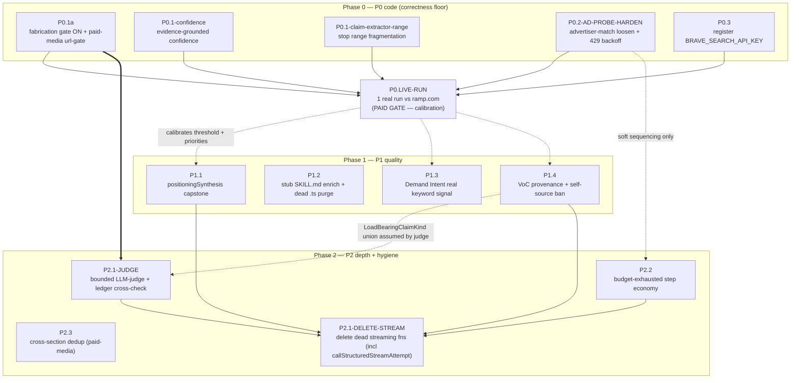

> **Method:** Multi-agent planning swarm (17 agents, critic-corrected). Read-only against the deployed lab-engine.
> **Target worktree:** `feat/v2-lab-section-wire` == `main` == `4237d9b2`. Lab engine runs IN-PROCESS in Vercel.
> **Source audit:** `docs/2026-05-29-research-quality-audit-C-to-A-plus.md`. **Workflow run:** `wf_94dc5b4b-17f`.
> **Status:** PLAN ONLY — no code changed. Approve before execution.

# AI-GOS Research Quality — Pass 2 Execution Plan (C → A+)

> **ID disambiguation (read first):** the source specs contain **two items both titled `P2.1`**. They are renamed here for the whole document:
> - **`P2.1-JUDGE`** — "Bounded LLM-judge + tool-result ledger cross-check behind the lexical verifier" (`depends_on: [P0.1a]`)
> - **`P2.1-DELETE-STREAM`** — "Delete dead partial-streaming functions streamRunSection + streamSectionViaAnswerTool + callStructuredStreamAttempt" (`depends_on: []`)
>
> **Worktree (system of record):** `/Users/ammar/Dev-Projects/AI-GOS-worktrees/v2-lab-section-wire` (branch `feat/v2-lab-section-wire`). All paths below are relative to that worktree root unless absolute. The lab engine runs **in-process in Vercel**, not the Railway worker — every env-var implication lands on the **Vercel** project env.

---

## 1. Sequencing overview

The work is sequenced **P0 → LIVE-RUN → P1 → P2**, with two hard cross-phase dependencies (`P2.1-JUDGE ⇐ P0.1a`, `P2.2 ⇐ P0.2`) and one calibration gate (the live run feeds threshold/priority decisions back into P0 and P1).

### Two corrections that reshape the run-section.ts merge chain (read before scheduling)

The draft asserted a strict order `P1.4 → P2.1-DELETE-STREAM` while P1.4 wired a guard into site **2579**, which lives inside `callStructuredStreamAttempt` — a dead function that `P2.1-DELETE-STREAM` deletes. That guaranteed P1.4's 2579 edit would be re-resolved/discarded against the deletion. Two verified facts kill the conflict:

1. **`positioningVoiceOfCustomer` is in `answerToolSectionIds` (run-section.ts:718).** It reaches **only** the `buildAnswerToolAttempt` path (~2763) and its `evaluateEvidenceSupport` call at **2791**. The other two `validateMinimums` sites — **2420** (`callStructuredAttempt`, the STRUCTURED path VoC never uses) and **2579** (`callStructuredStreamAttempt`, dead/streaming-only) — are **dead targets for VoC**. P1.4 is therefore re-scoped to the single live site only (and now never touches 2579).

2. **`callStructuredStreamAttempt` (defined at line 2456) is called only from inside the deleted `streamRunSection` block (3735/3818).** After P2.1-DELETE-STREAM removes the 3241-3915 block, `callStructuredStreamAttempt` becomes a zero-caller orphan. It (and its `validateMinimums`/`writeValidationEvent` machinery at ~2579) is now an explicit deletion target.

Net effect: **P1.4 and P2.1-DELETE-STREAM no longer overlap.** P1.4 edits only ~2763/2791; P2.1-DELETE-STREAM deletes 2456-~2650 plus 3241-3915. The merge order below keeps P2.1-DELETE-STREAM **last** purely to avoid re-resolving its large deletion against everyone else's inserts — not because of a P1.4 collision.

### Phase order and rationale

**Phase 0 (P0 code fixes)** — the correctness floor. These stop the system from *shipping fabrications and silently degrading*: turn the fabrication gate on (`P0.1a`), make confidence honest (`P0.1-confidence`), stop range-fragmentation verification theater (`P0.1-claim-extractor-range`), harden the ad probe (`P0.2-AD-PROBE-HARDEN`), and register the universal `web_search` SPOF (`P0.3`). All five are independent (no `depends_on`) and can be executed in parallel by separate Codex sessions, but they **share `run-section.ts` and `evidence-support.ts`**, so to avoid merge churn they are serialized in the order below (touch-set–disjoint first, shared-file items last). **Note (corrected):** `P0.2` does **not** touch `budget.ts` or `section-registry.ts` — its file set is `advertiser-match.ts`, `adlibrary.ts`, `_shared.ts`.

**LIVE-RUN gate (P0.LIVE-RUN)** — runs *after* the P0 code lands and *before* P1 priorities are locked. Rationale:
- It is the **only** way to calibrate the finite `LAB_VERIFIER_MAX_UNSUPPORTED` default that `P0.1a` ships (the audit saw 13/14/18 unsupported on real runs; the proposed on-switch default of 2 must be confirmed against a real run so it blocks gross fabrication without false-failing legitimate sections).
- It produces the **pass/fail verdict for the competitor-ad layer** that `P0.2` claims to fix — `P0.2` ships code + unit proofs, but the *behavioral* `displayableTotal > 0` proof is explicitly handed to the live run (see §2 — `P0.2` is **code-complete, behavior-unproven** until then).
- It answers the **Demand Intent blindness ratio** (check #6) and the **VoC self-sourcing** finding (check #5), which directly decide how aggressively `P1.3` and `P1.4` need to bite.
- It confirms **BRAVE_SEARCH_API_KEY presence in prod** (check #3) — the SPOF `P0.3` monitors. If the key is genuinely absent, `P0.3` flips `/api/health` to 503 the moment it deploys; the live run de-risks that before deploy.

**Phase 1 (P1)** — quality features whose priority/shape the live run informs: the synthesis capstone (`P1.1`), the stub-skill enrichment + dead-code purge (`P1.2`), real keyword signal for Demand Intent (`P1.3`), and VoC provenance + self-source ban (`P1.4`). All four are independent of each other and of P0 at the *compile* level, but the live run's findings (#1, #5, #6) decide their **ordering and aggressiveness**.

**Phase 2 (P2)** — depth and hygiene: the bounded LLM-judge (`P2.1-JUDGE`), budget-exhaustion step economy (`P2.2`), cross-section dedup (`P2.3`), and dead-streaming deletion (`P2.1-DELETE-STREAM`).
- **`P2.1-JUDGE` must follow `P0.1a`**: the judge *refines* the shortfall that the gate consumes. Without `P0.1a`'s finite threshold live in prod, the refined count is recorded as an honest badge but never *gates* a section — the judge is inert. It also reuses `getMaxUnsupportedAllowed`'s parse shape. **Note:** `P2.1-JUDGE`'s `crossCheckToolLedger` emits `UnsupportedLoadBearingClaim(kind:'numeric')`, and `P1.4` widens `LoadBearingClaimKind` to include `'quote'`; `P2.1-JUDGE` assumes the **post-P1.4** `LoadBearingClaimKind` union (`'numeric'|'url'|'quote'`). If the two are merged out of order, the judge's claim-kind handling must already account for `'quote'` — call this out to the executor.
- **`P2.2` must follow `P0.1a`/`P0.2` for merge-order on `run-section.ts`** (it threads the budget into the answer-tool prompt that several P0 items edit). The earlier "budget.ts/section-registry.ts merge conflict" rationale is **dropped as phantom** — verified that `P0.2` edits neither file. `P2.2` and `P0.2` are independent at the file level; the only reason to keep `P2.2` after the P0 cohort is to avoid re-resolving `run-section.ts` prompt edits. The `depends_on: [P0.2]` is therefore **soft** (sequencing convenience), not a hard data dependency. **Separately, `P2.2` has a hard correctness requirement of its own:** flipping the synthetic gap reason to `budget_exhausted` requires adding that literal to the `toolFinishedGapMetadataSchema` Zod enum in `activity-event.ts:61` (currently `missing_credential|api_error|rate_limited|not_implemented|aborted`) **and** updating `competitor-ad-probe.test.ts` (asserts `rate_limited` at 36/90/120) — both are now in `P2.2`'s file list.
- **`P2.1-DELETE-STREAM` and `P2.3` are independent** but scheduled last: `P2.1-DELETE-STREAM` deletes ~875 lines from `run-section.ts` (the 3241-3915 block **plus** the now-orphaned `callStructuredStreamAttempt` at 2456-~2650), so it must land *after* every other item that edits `run-section.ts` (P0.1a, P0.1-confidence, P1.1, P1.4, P2.1-JUDGE, P2.2) to avoid re-resolving the deletions against their inserts.

### Dependency graph



Solid arrows are **hard** dependencies (`depends_on` or merge-order). Dashed arrows are **soft** edges (calibration, type-union assumption, or sequencing convenience).

---

## 2. Phase gates

Every phase obeys the project Verification Gate (`.claude/rules/verification.md`): **a phase does not start until the prior phase's gate is green.** The universal gate for every item is:

- `cd /Users/ammar/Dev-Projects/AI-GOS-worktrees/v2-lab-section-wire && npm run build` → **exit 0**
- `npm run test:run` → **full suite green** (ignore only the documented pre-existing baseline: openrouter tests + chat blueprint tests)
- `npm run lint` → **0 new errors**

Per the worker-build learned-pattern: every item in this plan is **vercel-in-process**; no item touches `research-worker/`, so the worker build gate (`cd research-worker && npm run build`) is **not applicable** to any item here. Do not inherit the frontend baseline as a worker gate.

### Phase 0 gate

**Entry criteria:** clean worktree at HEAD; baseline `npm run build` + `npm run test:run` captured green before any edit.

**Mandatory verification (aggregated from P0 items' `verify[]`):**
- Build exit 0; full `test:run` green.
- `evidence-support.test.ts`: the three former-`Infinity` branches now assert finite default (2); `url`-only `loadBearingKinds` case passes. *(P0.1a)*
- `run-section-corpus-only.test.ts`: existing answer-tool gate tests green; new paid-media url-gate **fail** test + numeric-no-fail test + env-unset default-on test pass. *(P0.1a)*
- `deriveGroundedConfidence` unit test green (0/18→0.0, N/0→1.0, mixed→ratio, zero-claims→fallback); `grep -rn 'formatConfidenceToTen' src/components/research-v2/buyer-icp/renderer.tsx src/lib/research-v2/json-to-markdown.ts` returns **nothing**; the LIVE answer-tool `buildEnvelope` call site (2756) receives a defined `verification` so the stored confidence is derived (verified by a unit/integration assertion, not just code-reading). *(P0.1-confidence)*
- `claim-extractor.test.ts`: `$1M–$5M ARR` yields **one** numeric claim, zero of `$1/$5/1M/5M`; `structural-verifier.test.ts` + `verifier.eval.test.ts` still green. *(P0.1-claim-extractor-range)*
- `advertiser-match.test.ts`: the **not-top-but-domain-matched** candidate is accepted (a domain-matched candidate ranked below `top` with `top.score<0.8` now wins); long-name domain-word fallback passes; `Ramp` vs `Brex` still rejected. `fetchWithRetry`: 429-then-200 returns 200; abort-mid-backoff makes no second fetch; 404 passes through. *(P0.2)*
- `env.test.ts`: missing-`BRAVE_SEARCH_API_KEY` → `valid:false`; `health/route.test.ts` still green. *(P0.3)*

**Exit criteria:** all the above green; the 5 P0 commits landed on the worktree branch. **`P0.2` is `code-complete, behavior-pending`** — its goal (`displayableTotal > 0` for a known brand) is **not** provable in Phase 0; the unit gate proves only the loosening/backoff logic in isolation. A green Phase 0 gate does **not** mean the ad probe works end-to-end; that proof is deferred to LIVE-RUN check #1. **Do not deploy to Vercel yet** — the live run can target the deployed env, but the BRAVE-key 503 risk (`P0.3`) means deploy is gated on the live-run's check #3 confirming the key is provisioned.

### LIVE-RUN gate (paid)

**Entry criteria:** Phase 0 gate green. **Explicit user GO + spend authorization (~$0.20–$0.40, 1 run, 2 max).** Pre-run env table confirmed in Vercel (DEEPSEEK_API_KEY, BRAVE_SEARCH_API_KEY, SEARCHAPI_KEY, GOOGLE_ADS_*/META_*, `LAB_ENGINE_LIVE_TOOLS ≠ false`).

**Mandatory verification:** the 8 pass/fail assertions in §4. Plus the read-only harness sanity gate: `npm run build` exit 0 and `npm run test:run -- src/lib/research-v3/__tests__/soak-harness.test.ts src/lib/research-v3/__tests__/soak-monitor.test.ts` pass.

**Exit criteria:** a written verdict (in the handoff message, **not** a repo file) for all 8 checks, each PASS / FAIL+root-cause. The verdict sets: (a) the prod `LAB_VERIFIER_MAX_UNSUPPORTED` value, (b) whether `P0.2` is proven or needs another iteration, (c) the P1 ordering.

### Phase 1 gate

**Entry criteria:** LIVE-RUN verdict in hand; P0 commits green.

**Mandatory verification (aggregated):**
- Build exit 0; `npx tsc --noEmit` no new errors beyond baseline; full `test:run` green; lint clean.
- `section-registry.test.ts`: registry now exposes **8** sections incl. `positioningSynthesis`; schema test rejects <2/>3 options, rejects `recommendedMove.optionAngle` ∉ angles, rejects all-`gtmBrief` evidence, accepts fixture; `reader-sections.test.ts` ordering with synthesis at capstone. **Parent rollup unchanged:** `audit-state/route.ts` `children_total` (line 582) still equals `POSITIONING_SECTION_IDS.length` (6) — adding synthesis to `workerSectionIds`/`eventLimit` (lines 511/514) must NOT bump the children count, or the parent reports 7-8 and never completes. *(P1.1)*
- `skill-resolution.test.ts` passes for all registry slugs; `grep` confirms the 6 `*_SKILL` constants gone; `find src/lib/ai/prompts/positioning-skills -name '0*.ts'` empty; `grep -L 'keyFindings'` lists all 4 rewritten skills. *(P1.2)*
- demand-intent schema test rejects a `not disclosed` row **scoped to `keywordDemand.keywords[].monthlyVolume`**; `grep -rn "not disclosed" .../fixtures/demand-intent-artifact.ts` returns nothing (both line 39 monthlyVolume AND line 96 audienceSize handled — see P1.3); (Option A) `tool-catalog.test.ts` asserts `keyword_volume` present. *(P1.3)*
- `evidence-support.test.ts:78` still green (default does **not** gate quotes); new VoC-override gating test + `checkVoiceOfCustomerSelfSourcing` tests pass; `grep -n "positioningVoiceOfCustomer" run-section.ts` shows the VoC self-sourcing guard + load-bearing override at the **single live answer-tool site only** (~2763/2791), with **no** branch at 2420 or 2579. *(P1.4)*

**Exit criteria:** 4 P1 commits green; live behavioral checks for P1.1/P1.3/P1.4 deferred to the *next* cost-gated live run (do not loop paid APIs).

### Phase 2 gate

**Entry criteria:** Phase 1 gate green; `P0.1a` confirmed landed (hard dep for P2.1-JUDGE); `P1.4`'s `LoadBearingClaimKind` widening confirmed landed (P2.1-JUDGE assumes the `'quote'` member exists).

**Mandatory verification (aggregated):**
- Build exit 0; full `test:run` green; lint clean.
- `evidence-judge.test.ts`: `crossCheckToolLedger` flags `probes confirm N` with no matching tool output; `refineShortfallWithJudge` drops supported / keeps unsupported / respects cap; `applyEvidenceJudge` error-path falls back. `run-section-corpus-only.test.ts` unchanged (judge off by default). *(P2.1-JUDGE)*
- `budget-reserve.test.ts`: `genericRemaining()` cases pass, reserve cases stay green; `grep -rn 'reason: "rate_limited"' src/lib/lab-engine/agents` returns nothing; budget-line present in answer-tool prompt; **`activity-event.ts` `toolFinishedGapMetadataSchema` enum now includes `budget_exhausted`** (a tool-finished event carrying the new reason parses under `.strict()`); **`competitor-ad-probe.test.ts` updated** (assertions at 36/90/120 expect `budget_exhausted`, not `rate_limited`). *(P2.2)*
- `grep -n 'sourceSection'` shows new attribute-once bullets in the PaidMediaPlan branch of `build-prompts.ts`. *(P2.3 — prompt-only nudge; this proves the text was added, NOT that restatement dropped; behavioral proof deferred to a live paid-media run, see §6 risk on enforcement.)*
- `grep -rn "streamRunSection\|streamSectionViaAnswerTool\|callStructuredStreamAttempt" src research-worker` returns **nothing**; `runSection` entrypoint intact; `wc -l run-section.ts` dropped ~875. *(P2.1-DELETE-STREAM)*

**Exit criteria:** 4 P2 commits green; `run-section.ts` line count verified down; full suite green vs pre-change baseline.

---

## 3. The Codex hand-off specs

Topologically ordered by `depends_on` and merge-safety. Hand each block to **Codex (xhigh reasoning)**. Universal constraints (apply to all): worktree root `/Users/ammar/Dev-Projects/AI-GOS-worktrees/v2-lab-section-wire`; AI SDK v6 (`inputSchema`/`maxOutputTokens`, `generateText`+`Output.object`, no `generateObject` new sites, no `.min()/.max()` on Zod numbers sent to the model); no `.env` reads; commit per item; gate before handing off the next shared-file item.

---

### P0.1a — Turn the fabrication fail-gate ON and extend it to the paid-media structured path   [impact: high / effort: medium, vercel-in-process]

**GOAL:** No lab section commits 'complete' with ungrounded load-bearing claims — the answer-tool gate becomes active-by-default (finite threshold without requiring an env var), and the paid-media structured path runs the same evaluate→gate cycle, scoped to `url` claims so legitimate plan numbers don't false-fail.

**NON-GOALS:** No derived confidence in `buildEnvelope` (that's P0.1-confidence). No `$1M-$5M` claim-extractor fix (P0.1-claim-extractor-range). Don't touch dead streaming paths. No LLM-judge / lexical-verifier change (P2.1-JUDGE). Don't change `answerToolMaxRepairAttempts` or add section ids. No `positioningSynthesis` (P1.1). Do **not** register new env vars in `env.ts` — lab-engine reads `process.env`/`deps.env` directly.

**DEPENDS ON:** none.

**FILES:**
- `src/lib/lab-engine/agents/verification/evidence-support.ts` — (A) `getMaxUnsupportedAllowed` (L56-72) unset/empty/invalid fallback `Infinity` → finite const `defaultMaxUnsupportedAllowed = 2`; keep parsing valid ints ≥0 (incl `'0'`). (B) export `paidMediaLoadBearingKinds = ['url']`. *(symbols: `getMaxUnsupportedAllowed`, `verifierMaxUnsupportedEnvKey` L23, `defaultLoadBearingKinds` L22, `evaluateEvidenceSupport` L41-54)*
- `src/lib/lab-engine/agents/run-section.ts` — structured `runSection` (L3917-4225): compute `maxUnsupportedAllowed = getMaxUnsupportedAllowed(deps.env ?? process.env)` near top (mirror L2816); make `callStructuredAttempt` (L2357-2454) populate `attempt.evidenceSupportShortfall` via `evaluateEvidenceSupport`, passing `loadBearingKinds=['url']` when `sectionId==='positioningPaidMediaPlan'`; after artifact resolves, call `getEvidenceGateFailureReason` (L633-644); on non-null → `validation-failed` event + `recordSectionFailure` + throw `SectionRunnerError` **before** the commit block (L4186-4224). Edit ONLY `runSection` + `callStructuredAttempt`, NOT `streamRunSection`/`streamSectionViaAnswerTool`/`callStructuredStreamAttempt`.
- `src/lib/lab-engine/agents/verification/__tests__/evidence-support.test.ts` — flip the 3 `Infinity` assertions (L99/101-102/104-105) to finite default 2; keep `'0'`/`'2'` explicit cases; add a `loadBearingKinds=['url']` ignores-numeric case.
- `src/lib/lab-engine/agents/__tests__/run-section-corpus-only.test.ts` — add paid-media structured-path fail test (unsupported `url` claim → `evidence-gate:` reason, status `failed`, no artifact-saved); companion numeric-no-fail test; env-unset default-on answer-tool test.

**CONSTRAINTS:** `.claude/rules/verification.md` gate; `.claude/rules/ai-sdk-patterns.md`; threshold-only, additive, no migration. Default 2 is a conservative on-switch — **state loudly** it needs the live run to calibrate.

**STEPS:** (1) `defaultMaxUnsupportedAllowed = 2`, return it for unset/empty/non-int/negative, keep parsed int (incl 0). (2) export `paidMediaLoadBearingKinds = ['url'] as const`. (3) in `callStructuredAttempt` before final return (L2448) compute + attach `evidenceSupportShortfall`. (4) in `runSection` body (~L3929) add `maxUnsupportedAllowed`. (5) select committable `AttemptResult`, call `getEvidenceGateFailureReason`. (6) on non-null reason: emit `validation-failed`, `recordSectionFailure`, throw `SectionRunnerError` before commit. (7) update evidence-support tests. (8) add the 3 run-section tests. (9) run gate.

**VERIFY:** `npm run build` exit 0; `test:run -- .../evidence-support.test.ts`; `test:run -- .../run-section-corpus-only.test.ts`; full `test:run`; grep `src/lib/research-v2/lab-section-job.ts` confirms prod deps lack `env` (falls back to `process.env`). Prod tighten: set `LAB_VERIFIER_MAX_UNSUPPORTED` in **Vercel** env, not Railway.

**RISKS / ROLLBACK:** Too-tight default starts failing previously-committing sections — default 2 blocks gross 13/14/18 cases, tune post-live. Paid-media url-only is deliberate (all-numbers/no-URL plan commits unsourced). Structured path is fail-and-degrade (no grounding-repair loop). **Rollback:** restore `Infinity` fallback + revert run-section additions, OR soft-disable via large `LAB_VERIFIER_MAX_UNSUPPORTED` in Vercel. No migration.

---

### P0.1-confidence — Replace model-self-reported section confidence with an evidence-grounded value   [impact: high / effort: low, vercel-in-process]

**GOAL:** The artifact envelope's stored `confidence` is computed from the verification report (`verifiedCount / (verifiedCount + unsupportedCount)`) instead of `output.confidence`, and no user-facing prose/markdown/badge renders the decommissioned model number.

**NON-GOALS:** Don't remove `confidence` from `output`/SectionOutput/Zod schemas/answer-tool contract. Don't touch content-level confidence (offer-diagnostic proofPoint, buyer-icp item, ICE-table, keyword-intel, onboarding/prefill). Don't flip the gate / `LAB_VERIFIER_MAX_UNSUPPORTED` (P0.1a). No migration (thesis/confidence is JSONB). Don't re-add a reader badge. Don't change the envelope `confidence: z.number().min(0).max(1)` bound.

**DEPENDS ON:** none. *(Shares `evidence-support.ts` + `run-section.ts` with P0.1a — sequence after P0.1a to avoid conflict.)*

**FILES:**
- `.../lab-engine/agents/run-section.ts` — `buildEnvelope` (L288-324): replace `confidence: output.confidence` (L312) with `verification === undefined ? output.confidence : deriveGroundedConfidence(verification)`. **`buildEnvelope` is called from two LIVE sites: 2413 (`callStructuredAttempt`) and 2756 (`buildAnswerToolAttempt`).** (The draft listed a third site "2572" — that is inside the dead `callStructuredStreamAttempt`; do NOT count it and do NOT edit it. P2.1-DELETE-STREAM removes it.) *(`verification` param L299; import block L75)*
- `.../lab-engine/agents/verification/evidence-support.ts` — add+export pure `deriveGroundedConfidence(report): number = total===0 ? FALLBACK : verifiedCount/total`. *(`VerificationReport` from ./types L1)*
- `src/components/research-v2/buyer-icp/renderer.tsx` — **leak #1**: remove the `Confidence {formatConfidenceToTen(...)}/10` Badge (L43-48) + orphaned imports `formatConfidenceToTen`/`getConfidenceToneClass` (L14-16); remove `Badge` (L6)/`cn` (L17) only if unused.
- `src/lib/research-v2/json-to-markdown.ts` — **leak #2**: remove `> **Confidence:** ...` push (L47) + unused `formatConfidenceToTen` import (L4). Keep `PositioningSectionEnvelope.confidence` (L31).
- `.../lab-engine/agents/build-prompts.ts` — keep the two `Keep confidence in the 0..1 envelope scale.` lines (L434, L469) + root-shape block (L60-78); **add** one line telling the model not to narrate a confidence figure in verdict/statusSummary/prose/body.
- `.../verification/__tests__/evidence-support.test.ts` — add `describe('deriveGroundedConfidence')`: 0/18→0.0, N/0→1.0, mixed→ratio, zero-claims→fallback.

**CONSTRAINTS:** verification gate; check `Badge`/`cn` usage before removing (build breaks otherwise); FALLBACK recommended **0.0** (envelope is non-optional `min(0).max(1)`); derived value only on new runs (no backfill).

**STEPS:** (1) confirm `VerificationReport` shape in `types.ts`. (2) add `deriveGroundedConfidence`. (3) wire into `buildEnvelope` (covers both live sites 2413 + 2756 automatically since they call the same function). (4) strip buyer-icp Badge + imports (verify with grep). (5) strip json-to-markdown line + import (verify). (6) add build-prompts no-narrate lines (×2). (7) add unit test. (8) regression-scan `grep -rn 'artifact.confidence\|.confidence).toBe' .../agents/__tests__/`. (9) full gate.

**VERIFY:** build exit 0; `run-section-corpus-only.test.ts` green (no confidence-equality regression); verification unit test green; `grep -rn 'formatConfidenceToTen'` on the 2 leak files → nothing; `grep -n 'deriveGroundedConfidence' run-section.ts` shows use in `buildEnvelope`. **Answer-tool-path assertion (load-bearing):** a corpus-only/answer-tool test must prove the envelope built at the **2756** site stores the derived value — i.e. `verification` is defined and `confidence` equals `verifiedCount/total`, not `output.confidence`. Behavioral: 0-verified/18-unsupported stores 0.0 (not ~0.6).

**RISKS / ROLLBACK:** zero extractable claims → total===0 → FALLBACK (pick deliberately). Derived value is a function of verifier recall (the P0.1-claim-extractor-range bug depresses it; errs toward humility). Import-removal can break build if `Badge`/`cn` used elsewhere — check first. **Rollback:** `git revert` single commit; no migration/env/backfill.

---

### P0.1-claim-extractor-range — Stop claim-extractor from fragmenting numeric ranges   [impact: high / effort: low, vercel-in-process]

**GOAL:** `extractClaims` emits **one** whole-span numeric claim for a symbolic-separator range (`$1M–$5M ARR`, `$49–$99/mo`, `10,000–50,000 users`) instead of four substring-matchable fragments, closing the range-fragmentation verification-theater hole; all other claim kinds and currency/percent/magnitude extraction unchanged.

**NON-GOALS:** No LLM-judge/semantic verifier (P2.1-JUDGE). Don't widen the load-bearing set (numeric+url stays). No bare-counts / qualitative / tool-result coverage (P2.1-JUDGE). No word-separated ranges ("between $1M and $5M"). Don't change `structural-verifier.ts`/`evidence-support.ts`/`types.ts`/`run-section.ts`/env. Don't touch `buildNumericNeedles`/`findTextMatch`. No new env vars / model assumptions.

**DEPENDS ON:** none. *(Touch-set disjoint from all other P0 — safe to run first/parallel.)*

**FILES:**
- `src/lib/lab-engine/agents/verification/claim-extractor.ts` — add a range-detection pass in `extractStringClaims` (L72-150) **before** the currency/percent/magnitude loops (L105-133); module-level `rangePattern` near L13-19; emit a single `kind:'numeric'` claim for the full span via `pushClaim` (L39-70); mask matched spans (same-length space replacement) so fragment loops over consumed indices don't re-emit. Leave entityName (L85-93), url (L95-103), quote (L135-149) untouched.
- `.../verification/__tests__/claim-extractor.test.ts` — new `it()` under `describe('extractClaims')`: `$1M–$5M ARR` → one whole-range claim, no `$1/$5/1M/5M`; `$49–$99/mo` + `10,000–50,000 users`; regression assertion that `$49.00/mo`, `32%`, `200M interactions` extract unchanged.

**CONSTRAINTS:** verification gate; separator class `[–—-]` (en/em/hyphen), **exclude** `/` (unit sep like `$99/mo`); require ≥1 token to carry currency/`%`/magnitude so dates (`2024-2025`) / phone numbers don't get swallowed; mask preserves string length exactly; `raw` arg stays the original value.

**STEPS:** (1) re-read patterns (L13-19) + loops (L105-133). (2) add `rangePattern` (leading token, separator `[–—-]` optional spaces, trailing token, optional trailing unit word; anchor `(?<![\w$£€])` not `\b` before `$`; flags `gi`). (3) `value.matchAll(rangePattern)` → pushClaim whole span; record `[start,end]` intervals. (4) build `maskedValue`, run currency/percent/magnitude loops against it. (5) leave non-numeric paths alone. (6) add tests. (7) gate.

**VERIFY:** `node -e` repro: the 4 ranges return full span (leading `$` intact); `$49.00/mo`/`32%`/`200M`/`between $1M and $5M` → no range match. `claim-extractor.test.ts`; `structural-verifier.test.ts` + `verifier.eval.test.ts` green; build exit 0; full `test:run`. Behavioral: `structuralVerifier` on a body with `$1M–$5M ARR` against a corpus with `$1...$5` reports **unsupported** (anti-theater proof).

**RISKS / ROLLBACK:** over-broad pattern could swallow `555-1234`/`2024-2025` — mitigate by requiring currency/`%`/magnitude. Mask must preserve length. **Rollback:** one-file `git revert`, zero downstream coupling.

---

### P0.2-AD-PROBE-HARDEN — Harden the deterministic competitor-ad probe   [impact: high / effort: medium, vercel-in-process — code-complete, behavior-pending]

**GOAL:** The CompetitorLandscape deterministic ad probe lands displayable creatives for ≥1 known brand by surviving the two advertiser-match gates that silently drop them, and by retrying transient SearchAPI 429/5xx instead of burning a reserved lookup on a single rate-limit. **The behavioral proof (`displayableTotal > 0`) is NOT provable here — it is handed to LIVE-RUN check #1. This item ships the loosening/backoff code + unit proofs only.**

**NON-GOALS:** Don't re-implement the pre-execute probe or reserved-pool (already shipped). No new `generateObject`/answer-tool change. Don't touch `build-prompts.ts:254` post-gen count injection. No search-volume/ad-spend sources; no fabricated pricing. Don't run the live $2 validation here (LIVE-RUN). Don't bump `adReservedLookups`/`maxExternalLookups`/limits. Don't loosen match so far that wrong-entity ads leak (keep adUrl/domain guard L352-368 intact). **Do not touch `budget.ts` or `section-registry.ts` — they are not part of this fix.**

**DEPENDS ON:** none. *(Soft sequencing edge to P2.2 on `run-section.ts` prompt edits only — NOT a budget-file conflict.)*

**FILES (verified file set — `advertiser-match.ts`, `adlibrary.ts`, `_shared.ts`, tests only):**
- `src/lib/lab-engine/agents/tools/advertiser-match.ts` — (a) **`resolveBestCandidate` (L472): retarget the accept-on-domain-corroboration to the genuinely-uncovered case.** The resolver ALREADY accepts when `top.domainMatch && isDomainVerified===true` at **L616** (before the `score<0.8` rejection at L636). The real gap is when `top` is **NOT** the domain-matched candidate but a **lower-ranked** candidate IS domain-matched: today that lower-ranked candidate is discarded because only `top` is considered against the 0.8 floor. Add: when `isDomainVerified===true`, scan candidates for any `c.domainMatch===true` and accept that candidate even if `c.score<0.8` and it is not `top`. **The unit test MUST exercise this not-top-but-domain-matched path** (a fixture where `top.score≥0.8` is the wrong entity and a lower candidate has the verified domain), or the change is a no-op against current code and the test is a false-green. (b) `isAdvertiserMatch` (L329): long names (`compNorm length>6`) add a domain-base whole-word containment fallback symmetric to L443. Keep short-name guard L374-447 and adUrl/domain guard L352-368.
- `src/lib/lab-engine/agents/tools/adlibrary.ts` — `normalizeSearchApiRecords` (L425-452): make per-ad `isAdvertiserMatch` (L443-450) non-fatal — only run when `domain === undefined`; keep `hasUsableCreativeText` (L451). Route `fetchSearchApiJson` (L210-230) through `fetchWithRetry` (keep terminal `SearchApiHttpError(429)` → `apiErrorGap`).
- `src/lib/lab-engine/agents/tools/_shared.ts` — add exported `fetchWithRetry(url, options, {retries=2, retryOnStatus})` wrapping `timedFetch` (L82): on 429 or ≥500 wait capped backoff (400ms, 800ms), abort-aware (use `isAbortError` L99), never sleep after abort. `timedFetch` unchanged.
- `src/lib/lab-engine/agents/tools/__tests__/` — advertiser-match (**not-top-but-domain-matched accepted**, long-name domain-word fallback, short-name guard regression, `Ramp`-vs-`Brex` still rejected) + `fetchWithRetry` (429→200, 5xx→200, abort-mid-backoff, 404 passthrough).

**CONSTRAINTS:** verification gate; no-fabricated-pricing rule; gate the per-ad skip on `domain!==undefined` only; cap retries 2, backoff 400/800ms inside the 30s probe deadline. **Env locus:** `SEARCHAPI_KEY` must be in **Vercel** env or probe returns credentialGap regardless of code.

**STEPS:** (1) resolver: accept any domain-matched candidate (incl. not-top) when `isDomainVerified===true`. (2) long-name domain-word fallback (`\b${escapedBase}\b`). (3) per-ad gate `domain===undefined`-only. (4) `fetchWithRetry` (capped backoff, abort-aware). (5) wire into `fetchSearchApiJson`. (6) tests (incl. the not-top path). (7) gate (behavioral `displayableTotal>0` handed to LIVE-RUN).

**VERIFY:** build exit 0; `advertiser-match.test.ts` (not-top-but-domain-matched accepted; long-name fallback; short-name + `Ramp`/`Brex` regressions); tool `__tests__` (`fetchWithRetry`); full `test:run`. Behavioral (LIVE-RUN, not here): CompetitorLandscape for ramp.com → `buildCompetitorAdEvidenceGroups` ≥1 group with `displayableTotal>0`.

**RISKS / ROLLBACK:** loosening risks wrong-entity leakage — only widen long-name + verified-domain paths; short-name + adUrl guards stay. Skipping per-ad check trusts `resolveBestCandidate` — gate on `domain!==undefined`. `fetchWithRetry` adds ~1.2s/retried call inside the deadline — caps mitigate. Vercel `SEARCHAPI_KEY` must be present. **Rollback:** revert 3 source files + tests; no schema/migration/env/data change.

---

### P0.3 — Register BRAVE_SEARCH_API_KEY in env.ts so the universal web_search SPOF is monitored   [impact: medium / effort: low, vercel-in-process]

**GOAL:** `BRAVE_SEARCH_API_KEY` (the credential behind `web_search`, every section's primary search) is validated by `validateEnv()` so its absence surfaces as a hard `/api/health` 503 instead of silently gapping every section.

**NON-GOALS:** Don't add it to `research-worker/` (in-process in Vercel only). Don't change `brave-search.ts` runtime fallback (L94-98). Don't touch firecrawl/searchapi/perplexity registrations. No Zod/`.min()/.max()` (env.ts uses plain string arrays). Don't change `/api/health` shape/status logic.

**DEPENDS ON:** none. *(Touch-set disjoint — safe to run parallel.)*

**FILES:**
- `src/lib/env.ts` — add `"BRAVE_SEARCH_API_KEY"` to `REQUIRED_ENV_VARS.server` tuple (L9-14) with an inline comment; the L77-82 validation loop needs no change.
- `src/lib/__tests__/env.test.ts` — add `process.env.BRAVE_SEARCH_API_KEY = "test-brave-key"` to `setRequiredEnv()` (L8-16); add an assertion: deleting it → `valid:false` and `missing` includes `'BRAVE_SEARCH_API_KEY'`.

**CONSTRAINTS:** verification gate; **read `src/app/api/health/__tests__/route.test.ts` before running it** — if it arranges a valid env without this key, set it there too. `BRAVE_SEARCH_API_KEY` must be in **Vercel** (Production + Preview), not Railway.

**STEPS:** (1) add tuple entry inside `server: [...] as const`. (2) add the key to `setRequiredEnv()`. (3) add the missing-key `it()` mirroring the existing "missing server vars" test. (4) document in commit body the Vercel-env requirement.

**VERIFY:** build exit 0; `env.test.ts` all pass; `health/route.test.ts` still passes; behavioral: with all required set except this key, `GET /api/health` returns 503 with `checks.environment.missing` including `'BRAVE_SEARCH_API_KEY'`; `grep -rn 'BRAVE_SEARCH_API_KEY' src/lib/env.ts` → exactly one new registration.

**RISKS / ROLLBACK:** promoting to REQUIRED flips `/api/health` to 503 in any env lacking the key (intended — that *is* the monitor) until the key is added to Vercel. The health-route test may assume a fixed required set — update its arrange step the same way. **Rollback:** revert the two edits; `brave-search.ts` behavior unchanged either way.

---

### P0.LIVE-RUN — Live-run validation protocol   [impact: high / effort: medium, vercel-in-process — PAID GATE]

Rendered in full as a boxed section in §4.

---

### P1.1 — Add positioningSynthesis section   [impact: high / effort: high, vercel-in-process + frontend]

**GOAL:** A seventh lab-engine section `positioningSynthesis` reads all six committed positioning artifacts and emits ONE recommended positioning wedge + 2-3 divergent candidate angles (every claim `sourceSection`-traced), persists as a typed artifact, renders as a reader capstone card, auto-dispatches after 6/6, and writes the real synthesized thesis into `research_artifacts.thesis`.

**NON-GOALS:** Don't change the paid-media plan schema/runner/normalizer/renderer (only its dispatch ordering vs synthesis). Don't re-run/re-fetch the six sections (pure synthesis, no external tools). Don't hard schema-force prose beyond structural minimums (enforce divergent-options count + sourceSection tracing only). No `thesis` column migration (JSONB). No new Supabase zone enum (free string). Don't route through answer-tool (mirror paid-media structured path). Don't change `LAB_ENGINE_PROVIDER` / hard-code a model. **Critically: do NOT add `positioningSynthesis` to `POSITIONING_SECTION_IDS` (the 6-section rollup key) and do NOT let it bump the parent `children_total`.**

**DEPENDS ON:** none (compile). *(Soft: LIVE-RUN informs reader-ordering + token-budget decisions. Merge-order: lands before P2.1-DELETE-STREAM since it edits `run-section.ts`.)*

**FILES:** *(verified paths; full list)*
- `src/lib/ai/prompts/positioning-skills/index.ts` — `POSITIONING_SYNTHESIS_SECTION_ID`; insert into `ALL_POSITIONING_SECTION_IDS` **before** `PAID_MEDIA_PLAN_SECTION_ID`; extend `AllPositioningSectionId` + `ALL_POSITIONING_SECTION_LABELS`. **Do NOT touch `POSITIONING_SECTION_IDS` (stays 6).**
- `src/lib/lab-engine/artifacts/schemas/positioning-synthesis.ts` — **NEW**. Mirror `paid-media-plan.ts`: `situationThesis`, `positioningOptions[2-3]`, `recommendedMove`, `messagingDirections`; `validatePositioningSynthesisMinimums` (IRON LAW: 2-3 divergent options; `recommendedMove.optionAngle ∈ angles`; evidenceRefs non-`gtmBrief` traced; sources ≥ min). `.describe()` not `.min/.max` on model-sent numbers; array-length checks live in the validator.
- `src/lib/lab-engine/fixtures/positioning-synthesis-artifact.ts` — **NEW**. Valid envelope passing the validator.
- `src/lib/lab-engine/skills/positioning-synthesis/SKILL.md` — **NEW**. Mirror paid-media SKILL.md; cross-section strategist; IRON LAW.
- `src/lib/lab-engine/sections/section-registry.ts` — `positioningSynthesis` entry (skillSlug `positioning-synthesis`, `allowedTools []`, `maxExternalLookups 0`, `requiredEvidenceClasses []`, schemas, validator, fixture) + `satisfies` block.
- `src/lib/lab-engine/sections/sub-sections.ts` — `positioningSynthesis` entry in `SECTION_SUB_SECTIONS`.
- `src/lib/lab-engine/agents/build-prompts.ts` — `sectionIdByOutputSchemaName` + `buildSectionMinimumGuidance` branch for `PositioningSynthesisSectionOutput`.
- `src/lib/lab-engine/agents/run-section.ts` — `positioningSynthesisGenerationSchema` + `getStructuredGenerationSchema` branch + `withNormalizedPositioningSynthesisOutput` wired into `withNormalizedSectionOutput`; keep OUT of `answerToolSectionIds`.
- `src/app/api/research-v2/run-lab-section/route.ts` — `getDispatchZones` returns `[POSITIONING_SYNTHESIS_SECTION_ID]` for synthesis; generalize `buildPaidMediaResearchInput`; reuse the 6/6 `positioning_sections_not_ready` guard.
- `src/lib/research-v2/use-audit-state.ts` — synthesis auto-dispatch mirroring paid-media (`hasPositioningSynthesisStarted`/`isPositioningSynthesisTerminal`/`dispatchPositioningSynthesis` + `dispatchedSynthesisRunIds` ref).
- `src/lib/research-v2/supabase-run-store.ts` — `saveArtifact`: on `sectionId==='positioningSynthesis'`, **merge** a synthesized thesis into `research_artifacts.thesis` via pure `buildSynthesizedThesisPatch` (preserve onboarding `gtmBriefSnapshot`). **Verify `markParentCompleteWhenAllSectionsCommit` still keys on `POSITIONING_SECTION_IDS` (lines 214/223/231) — synthesis must NOT count toward parent completion.**
- `src/types/positioning-artifact.ts` — `PositioningSynthesisArtifact` + `TYPED_ARTIFACT_KEYS_BY_ZONE` entry.
- `src/components/research-v2/section-renderers/positioning-synthesis.tsx` — **NEW** renderer + barrel re-export in `.../section-renderers/index.ts`.
- `src/components/research-v2/typed-artifact-renderer.tsx` — `positioningSynthesis` switch case.
- `src/components/research-v3/reader-sections.ts` — add `positioningSynthesis` to ordering (capstone — confirm exact position with user).
- `src/app/api/research-v2/audit-state/route.ts` — generalize `hasPaidMediaPlanRow`/`workerSectionIds` (line 511)/`eventLimit` (line 514, `= 12 * workerSectionIds.length`) to include the synthesis zone **when a synthesis row exists**. **HARD CONSTRAINT: `children_total` (line 582) must remain `POSITIONING_SECTION_IDS.length` (6).** Adding synthesis to `workerSectionIds` widens `eventLimit` and the `workerStates` map (correct — its telemetry must surface), but if it also bumps `children_total`, the parent reports 7-8 children and never completes. Confirm the two are computed from different sources and the synthesis addition flows only into `workerSectionIds`/`eventLimit`, never `children_total`.

**CONSTRAINTS:** use `npx tsc --noEmit` as the exhaustive wiring checklist (the new SectionId propagates through `Record<SectionId>` maps); keep synthesis OUT of `POSITIONING_SECTION_IDS` and the parent-complete rollup (else parent never completes); thesis update must **merge** not replace; `.describe()` on model-sent numbers.

**STEPS:** ids/labels → schema → fixture → SKILL.md → registry → sub-sections → prompts → runner → dispatch route → thesis persistence → types → renderer → reader ordering → audit-state (with the `children_total`-stays-6 guard) → frontend dispatch → tests → verify. (Step 1 = edit ids and let `tsc` enumerate the rest.)

**VERIFY:** build exit 0; `tsc --noEmit` no new errors; `section-registry.test.ts` → 8 sections; schema test (rejects <2/>3, bad `optionAngle`, all-`gtmBrief`; accepts fixture); `reader-sections.test.ts` capstone ordering. **Rollup assertion:** an audit-state unit/integration test confirms `children_total === 6` even with a synthesis row present, and `markParentCompleteWhenAllSectionsCommit` fires on 6/6 positioning commits (not 7/7). Behavioral (cost-gated/fixture): after 6/6, `audit-state` shows synthesis complete; reader renders capstone with 2-3 angles + `recommendedMove`; `research_artifacts.thesis` shows synthesized `headlineWedge` (not just onboarding bookkeeping); `research_artifact_sections` row `zone='positioningSynthesis' status='complete'`.

**RISKS / ROLLBACK:** SectionId propagation can miss a `Record` map (tsc catches). Must NOT count synthesis toward `children_total`/parent-complete (verified the rollup keys on `POSITIONING_SECTION_IDS`; the only real risk is `audit-state` line 582 — the gate above covers it). Thesis merge must not clobber `gtmBriefSnapshot`. Verify no server-side CHECK/enum on `zone` before the live run. **Rollback:** `git revert` removes all new files + wiring; thesis merge is additive (prior values intact); no migration.

---

### P1.2 — Port copy-strategy hooks into 4 stub SKILL.md, delete dead positioning-skills .ts, add skill-resolution CI test   [impact: medium / effort: medium, vercel-in-process]

**GOAL:** The four 44-46 line stub skills (buyer-icp, voice-of-customer, demand-intent, offer-diagnostic) are rewritten to the rich SKILL.md template with their stranded copy-strategy hooks; the six orphaned `positioning-skills/0N*.ts` files are deleted while every live ID constant survives; a CI test fails if any `SECTION_REGISTRY.skillSlug` lacks a readable SKILL.md.

**NON-GOALS:** Don't touch the rich live skills (positioning-market-category 267L, positioning-competitor-landscape 504L, positioning-paid-media-plan). Don't change Zod schemas/`validateMinimums`/build-prompts enum guidance/registry entries (content + dead-code + 1 test only). Don't re-port trigger-windows (already in buyer-icp schema). Don't port the dead flat output contract (`keyFindings/evidenceQuotes/...`) — live schemas are nested `.strict()`. Don't remove the ID constants from `index.ts` (imported by 10+ files). Don't touch `copywriting-persona.ts`/`prompts/index.ts`.

**DEPENDS ON:** none.

**FILES:**
- `src/lib/lab-engine/skills/positioning-buyer-icp/SKILL.md` — rewrite to rich template; port Schwartz awareness→headline mapping into `awarenessDistribution`; keep nested body keys + IRON LAW.
- `src/lib/lab-engine/skills/positioning-voice-of-customer/SKILL.md` — rewrite; port hair-on-fire success language + independent-source counting + competitor/adjacent reviews rule into `successLanguage`; keep verbatim IRON LAW.
- `src/lib/lab-engine/skills/positioning-demand-intent/SKILL.md` — rewrite; port content-only-top3 = paid-wedge + content-gap framing + intent-vs-interest into `contentGaps`; keep no-fabricated-volume IRON LAW.
- `src/lib/lab-engine/skills/positioning-offer-diagnostic/SKILL.md` — rewrite; port self-data-only + channel-truth + red-flag motion-vs-math + benchmarks-are-floors; keep no-invent-CAC/LTV IRON LAW.
- `src/lib/ai/prompts/positioning-skills/index.ts` — delete the 6 `export { *_SKILL } from './0N-*'` lines (L9-14); **keep** all ID const/type/function exports (L16-67).
- `src/lib/ai/prompts/positioning-skills/01..06*.ts` — **delete all six** files.
- `src/lib/lab-engine/sections/__tests__/skill-resolution.test.ts` — **NEW**, modeled on `skill-registry-parity.test.ts`: for each `SECTION_REGISTRY` def, `readFileSync(join(cwd,'src/lib/lab-engine/skills',skillSlug,'SKILL.md'))` succeeds, length >200, frontmatter `name:` === slug.

**CONSTRAINTS:** verification gate; **do not** copy the flat `keyFindings` output block (would break `.strict()` schemas — `grep -L 'keyFindings'` must list all 4); keep each section's Research Tools table identical to its current `allowedTools` (parity test); preserve each frontmatter `name:` exactly (new test asserts name===slug).

**STEPS:** internalize the market-category template → extract prose-only hooks → rewrite the 4 stubs → trim `index.ts` → delete 6 `.ts` → orphan-reference sweep (grep the 6 constant names → must be empty) → add CI test → gate.

**VERIFY:** build exit 0 (no dangling imports); `skill-resolution.test.ts` passes all 7 slugs; `skill-registry-parity.test.ts` green; full `test:run`; `grep -rn` the 6 `*_SKILL` names → nothing; `find ...positioning-skills -name '0*.ts'` → nothing; each rewritten SKILL.md `wc -l` ≫ 46; `grep -L 'keyFindings'` lists all 4; lint clean.

**RISKS / ROLLBACK:** porting the flat output block → runtime `.strict()` validation failures (non-goals + grep guard catch). Parity test breaks if a tool row from the wrong section is copied — keep tool tables == current `allowedTools`. Prose-only change can shift model behavior on paid runs (defer live validation). **Rollback:** `git checkout --` the 5 edited files + restore deleted `.ts` + rm the new test; pure content/test, fully reversible.

---

### P1.3 — Give Demand Intent a real keyword signal and reject "not disclosed"   [impact: high / effort: medium, vercel-in-process]

**GOAL:** Every Demand Intent keyword row carries a falsifiable, tool-grounded signal (real SpyFu search volume + CPC [Option A], OR live paid-vs-organic SERP composition [Option B]), and the validator hard-rejects the literal `"not disclosed"` **scoped to the keyword signal field**.

**NON-GOALS:** Don't touch the other 5 sections / paid-media schemas. No `positioningSynthesis` (P1.1). Don't flip the gate (P0.1a) or harden the ad probe (P0.2). Don't rewrite legacy `src/lib/ai/tools/mcp/spyfu-tool.ts` (V1 sub-agents). No `.min/.max` on model-sent numbers. No Supabase migration / envelope shape change beyond the keyword fields.

**DEPENDS ON:** none. **⚠ DECISION GATE — user must pick Option A vs B before coding (file set differs).** Recommendation: **Option A** (SpyFu `keyword_volume` — `spyfu-client.ts` already batches 100 keywords in one call, fits the 5-lookup budget, real volume+CPC+difficulty, least new code). Fallback B if the SpyFu account is dead.

**FILES (both):**
- `src/lib/lab-engine/artifacts/schemas/demand-intent.ts` — edit `keywordSignalSchema` (L33-43); extend `validateDemandIntentMinimums` (L132-192) to push an error when **a keyword signal field** contains `/not disclosed/i`. **SCOPING (load-bearing — verified two refusal strings in the fixture):** the validator must scan **only `keywordDemand.keywords[].monthlyVolume`** (Option A) / the keyword serp-composition fields (Option B), NOT the full keyword/body. The demand-intent fixture has `"not disclosed"` at **L39 (monthlyVolume — the intended target)** AND **L96 (audienceSize — a different, legitimately-undisclosed field)**. A full-body refusal scan would trip on L96 and false-fail the fixture. Scope the guard precisely to the keyword signal field; document that L96 `audienceSize` is intentionally untouched. *(If the user wants `audienceSize` also de-refused, that is a separate explicit decision — default: leave L96 as-is and fix only the fixture's L39 in the fixture step below.)*
- `src/lib/lab-engine/skills/positioning-demand-intent/SKILL.md` — rewrite the IRON LAW (L18) that currently *instructs* `"not disclosed"` (root cause); add `keyword_volume` (Option A) to the tools table (L22-26).
- `src/lib/lab-engine/agents/build-prompts.ts` — update DemandIntent item-contract (L344-354) to restate new key(s) + forbid the literal in the keyword signal.
- `src/lib/lab-engine/fixtures/demand-intent-artifact.ts` — remove `"not disclosed"` at **L39 (monthlyVolume)** so the fixture passes the new (signal-scoped) validator. **Leave L96 (audienceSize) as-is** unless the user opts to widen scope.

**FILES (Option A only):**
- `src/lib/lab-engine/agents/tools/keyword-volume.ts` — **NEW** ai-SDK-v6 `tool()` mirroring `keyword-ad-probe.ts`; imports `getKeywordsByBulkSearch`/`getRelatedKeywords` from `@/lib/ai/spyfu-client`; `credentialGap('SPYFU_API_KEY')` when key absent; returns `{keyword, searchVolume, cpc, difficulty}`.
- `src/lib/lab-engine/agents/tools/index.ts` — add `keyword_volume: keywordVolumeAgentTool` to `TOOL_CATALOG` (L10-19).
- `src/lib/lab-engine/sections/section-registry.ts` — add `"keyword_volume"` to `positioningDemandIntent.allowedTools` (L226); consider bumping `maxExternalLookups` (L227).
- `src/lib/lab-engine/agents/tools/__tests__/tool-catalog.test.ts` — keep the `spyfu`-absent assertion (L8); add a positive `keyword_volume` present assertion.
- `src/lib/env.ts` — add `'SPYFU_API_KEY'` to `OPTIONAL_ENV_VARS.server` (L40-58). Vercel env, not Railway.

**CONSTRAINTS:** verification gate; `.describe()` not `.min/.max`; prefer the bulk SpyFu path (one POST, ≤100 keywords) to stay within the 5-lookup budget; label SpyFu data "SpyFu-estimated" (no-fabricated-pricing rule — sourced+attributable is allowed). Option B is a **breaking schema shape change** (`monthlyVolume:string` → `organicCount/adCount:number`) — grep `src/components`/`src/app` for `monthlyVolume` and update the renderer.

**STEPS:** decision gate → **signal-scoped** refusal-string guard in validator (target `keywordDemand.keywords[].monthlyVolume` only) → (A) new tool + catalog + allowedTools + env + test, or (B) replace schema fields + serpProbeUrl → SKILL.md IRON LAW rewrite → build-prompts → fixture (fix L39 only, leave L96) → gate.

**VERIFY:** build exit 0; `artifacts/schemas` tests (a `"not disclosed"` **monthlyVolume** row rejected; a `"not disclosed"` value in a non-signal field like `audienceSize` does NOT trip the guard); (A) `tool-catalog.test.ts` (`keyword_volume` present, `spyfu` absent); `sections` registry tests; `grep -rn "not disclosed" .../fixtures/demand-intent-artifact.ts` → nothing **(both L39 and L96 must be clean for the grep to pass — so the fixture step must also resolve L96; if L96 is intentionally kept as a different sentinel, change its string to something that is not the literal `"not disclosed"`, or scope this grep to the keyword block).** Behavioral (LIVE-RUN): every keyword row carries a numeric signal, zero `"not disclosed"`.

> **Resolution note on the L96 tension:** the *validator* is scoped to the keyword signal only (so it does not false-fail on `audienceSize`). The *fixture grep* (`grep "not disclosed" ... → nothing`) is a stricter cleanliness check. To satisfy both without widening the validator: in the fixture, replace L39's `"not disclosed"` with a real numeric volume AND replace L96's `audienceSize: "not disclosed"` with a non-literal phrasing (e.g. `"unverified — no public sizing"`). This keeps the validator narrow, keeps the fixture grep green, and documents that `audienceSize` undisclosure is a content gap, not a refusal token.

**RISKS / ROLLBACK:** Option B ripples into the renderer. Option A depends on a live, funded `SPYFU_API_KEY` in Vercel — if dead, every call is a credentialGap and the section now FAILS persistence (validator rejects the refusal literal) rather than shipping blind. Per-keyword calls can blow the 5-lookup budget — prefer A's bulk path. **Rollback:** revert demand-intent/SKILL/build-prompts/fixture (+ A: delete tool, revert catalog/allowedTools/env/test); no migration.

---

### P1.4 — Chain reviews→firecrawl, carry role/date on VoC pain quotes, ban self-sourced quotes, make VoC quotes load-bearing   [impact: high / effort: medium, vercel-in-process]

**GOAL:** Voice-of-Customer never presents the subject company's own homepage as buyer "pain language": pain quotes carry provenance (role/date), quotes whose `sourceUrl` domain == subject domain are deterministically rejected (forcing repair), reviews snippets are enriched via firecrawl, and unsupported VoC quote claims are gated as load-bearing.

**NON-GOALS:** Don't change the uniform `validateMinimums` signature (add a VoC-only guard). Don't make `quote` claims load-bearing globally (only VoC). No `.min/.max` on model-sent numbers. Don't touch corpus/onboarding/dispatch/other sections. No new `generateObject`/answer-tool change. Role/date only on `painQuoteSchema` (not objections/switchingStories/etc.). Don't hard-fail on self-sourcing — return a `validateMinimums`-style error so the repair loop retries. **Do NOT wire the guard at the structured/streaming sites 2420 or 2579 — VoC never reaches them (see SCOPING).**

**DEPENDS ON:** none. *(Shares `run-section.ts` + `evidence-support.ts` with P0.1a/P0.1-confidence/P2.1-JUDGE — sequence after those; lands before P2.1-DELETE-STREAM. After this re-scope, P1.4 and P2.1-DELETE-STREAM no longer touch overlapping lines.)*

**SCOPING — the load-bearing correction (verified against run-section.ts):**
- `positioningVoiceOfCustomer` is in `answerToolSectionIds` (**L718**), so VoC reaches **only** the `buildAnswerToolAttempt` path (~**2763**) and its `evaluateEvidenceSupport` call at **2791**.
- Site **2420** is inside `callStructuredAttempt` (the STRUCTURED path — VoC never uses it). Site **2579** is inside `callStructuredStreamAttempt` (a DEAD streaming-only function that P2.1-DELETE-STREAM deletes).
- Wiring the guard at 2420 or 2579 is **dead/orphaned work** and 2579 lives in soon-deleted code. **P1.4 wires the self-sourcing guard + the `['numeric','url','quote']` `loadBearingKinds` override at the single live site only (`buildAnswerToolAttempt` ~2763 / `evaluateEvidenceSupport` 2791).**
- `buildAnswerToolAttempt` is a **non-async helper** and does **NOT currently receive `researchInput`/`subjectDomain`** as a parameter (`researchInput` is read at the `runSection`/`runSectionViaAnswerTool` level). The spec must **add `subjectDomain` as an explicit argument** to `buildAnswerToolAttempt` and pass `researchInput.company.websiteUrl` from the caller — do NOT assume it is in lexical scope at 2718-2807, or the guard cannot compile at 2763.

**FILES:**
- `src/lib/lab-engine/agents/tools/reviews.ts` — extend `ReviewsOutputSchema` excerpt objects with optional `role`/`date` (`.describe()`, keep `.strict()`); SERP parse leaves them undefined (L90-94).
- `src/lib/lab-engine/agents/tools/firecrawl.ts` — **reference only**, no code edit expected (chaining is prompt-driven; firecrawl already in VoC allowedTools).
- `src/lib/lab-engine/artifacts/schemas/voice-of-customer.ts` — add `role`/`date` optional to `painQuoteSchema` (L31-39); export `checkVoiceOfCustomerSelfSourcing({artifact, subjectDomain})`: reject any pain quote whose registrable host == subject registrable host, and reject when a single `sourceUrl` supplies >50% of pain quotes (the L162-169 uniqueCount-of-hostname check has no per-source cap).
- `src/lib/lab-engine/agents/section-agent.ts` — mirror `role`/`date` in `painQuoteProviderSchema` (L710-726).
- `src/lib/lab-engine/agents/build-prompts.ts` — VoC branch (L331-342): list optional role/date, firecrawl-chaining instruction, subject-domain ban, no-single-source-majority rule.
- `src/lib/lab-engine/agents/verification/evidence-support.ts` — widen `LoadBearingClaimKind` (L3) to include `'quote'` → `'numeric'|'url'|'quote'`; keep `defaultLoadBearingKinds = ['numeric','url']` unchanged. *(P2.1-JUDGE assumes this widened union — do not narrow it back.)*
- `src/lib/lab-engine/agents/run-section.ts` — **(1)** add `subjectDomain` as an explicit parameter to `buildAnswerToolAttempt` (signature change; thread `researchInput.company.websiteUrl` from `runSectionViaAnswerTool`); **(2)** inside `buildAnswerToolAttempt` (~2763), after the VoC `validateMinimums` early-return, call `checkVoiceOfCustomerSelfSourcing({ artifact, subjectDomain })` when `sectionId==='positioningVoiceOfCustomer'` and return a minimums-style failure on `!ok`; **(3)** at the `evaluateEvidenceSupport` call (2791) pass `loadBearingKinds:['numeric','url','quote']` only when `sectionId==='positioningVoiceOfCustomer'`. **Do NOT add any branch at 2420 or 2579.** Prefer one small helper to avoid duplication.

**CONSTRAINTS:** verification gate; domain-match granularity = **registrable domain** (last two labels) for both sides (defeats `blog.subject.com` evasion); single-source cap recommended `> floor(n/2)`; scope to `painLanguage` only; `subjectDomain` is a real param, not assumed scope.

**STEPS:** schema role/date (canonical + provider mirror) → `checkVoiceOfCustomerSelfSourcing` (reuse `getSourceKey` L136-142, compare registrable domains) → widen `LoadBearingClaimKind` to add `'quote'` → **add `subjectDomain` param to `buildAnswerToolAttempt` + thread it from the caller** → self-sourcing guard at the single live site (~2763) → VoC load-bearing override at 2791 → prompt guidance → tests → gate.

**VERIFY:** build exit 0; full `test:run` incl. `evidence-support.test.ts:78` (default still does NOT gate quotes) + new VoC-override gating test + new `checkVoiceOfCustomerSelfSourcing` tests; targeted `evidence-support.test.ts` + `build-prompts.test.ts`. Behavioral unit (no paid API): a pain quote with registrable host == subject websiteUrl host → `ok:false`; a g2.com quote → `ok:true`; a VoC report with an unsupported `quote` → `unsupportedLoadBearing` length 0 default but ≥1 with `'quote'`. **Scope proof:** `grep -n "positioningVoiceOfCustomer\|checkVoiceOfCustomerSelfSourcing" run-section.ts` shows the guard + override **only** in the `buildAnswerToolAttempt` region (~2763/2791), with **zero** hits near 2420 or 2579.

**RISKS / ROLLBACK:** making VoC quotes load-bearing can spike repair loops (firecrawl-chaining mitigates by recovering full verbatims). Fixture `saaslaunch.ts` uses `example.com` not prod `saaslaunch.net` — tests must key off live `researchInput.company.websiteUrl` (now passed as `subjectDomain`). Subdomain mismatch → use registrable domain. Genuinely-starved VoC may exhaust repair and commit honest-gap (desired). The `buildAnswerToolAttempt` signature change touches its other callers (the repair-loop call) — update both call sites. **Rollback:** revert the `buildAnswerToolAttempt` param + guard + override + `LoadBearingClaimKind`; schema role/date are backward-compatible and can stay; no migration/env. *(Note: leaving `'quote'` in `LoadBearingClaimKind` on rollback is harmless and is assumed by P2.1-JUDGE if that already landed.)*

---

### P2.1-JUDGE — Bounded LLM-judge + tool-result ledger cross-check behind the lexical verifier   [impact: high / effort: medium, vercel-in-process]

**GOAL:** After the lexical pass flags load-bearing claims as "unsupported", run a bounded LLM judge ("does this excerpt support this claim?") plus a deterministic tool-ledger cross-check ("probes confirm N" / "ad library shows" validated against the section's actual tool-call results) so the gate stops both lexical false-positives and uncheckable fabricated counts.

**NON-GOALS:** Don't rewrite the lexical verifier / claim-extractor (P0.1-claim-extractor-range). No new claim kinds / make quotes load-bearing (P1.4). Don't gate the paid-media structured path (P0.1a). Don't read `research_section_events` for the cross-check (use in-memory `modelSteps[].toolResults`). No `generateObject` (use `generateText`+`Output.object`). Don't change the structured path or timeout hierarchy. Don't enable a hard gate by default (`LAB_VERIFIER_MAX_UNSUPPORTED=Infinity` default stays — P0.1a owns turning it on).

**DEPENDS ON:** **`P0.1a`** (sequencing — the refined count only *gates* once P0.1a's finite threshold is live; also reuses `getMaxUnsupportedAllowed` parse shape). **ASSUMES the post-P1.4 `LoadBearingClaimKind` union** (`'numeric'|'url'|'quote'`). `crossCheckToolLedger` constructs `UnsupportedLoadBearingClaim(kind:'numeric')`, but its claim-kind handling and any exhaustive `switch`/type-narrowing over `LoadBearingClaimKind` must account for `'quote'`. If P2.1-JUDGE is somehow merged before P1.4, add the `'quote'` member to `LoadBearingClaimKind` here instead (and note the duplication for P1.4 to reconcile). Sequence after P1.4 to avoid this.

**FILES:**
- `src/lib/lab-engine/agents/verification/evidence-judge.ts` — **NEW**. Export `crossCheckToolLedger({body, toolResults})` (deterministic ledger-assertion scan → extra `UnsupportedLoadBearingClaim[]`), `refineShortfallWithJudge(...)` (per-flagged-claim `generateText`+`Output.object` verdict, cap `maxClaims=8`, drop judge-supported), `applyEvidenceJudge(...)` (refine + merge ledger, error-swallow to input shortfall), `judgeVerdictSchema` (no `.min/.max`).
- `src/lib/lab-engine/agents/verification/evidence-support.ts` — add+export `getJudgeMaxClaims(env)` (`LAB_VERIFIER_JUDGE_MAX_CLAIMS`, default 8), `isEvidenceJudgeEnabled(env)` (`LAB_VERIFIER_JUDGE_ENABLED`, default false), `rebuildShortfallIssues(...)` (reuse `formatUnsupportedClaimIssue`).
- `src/lib/lab-engine/agents/run-section.ts` — in `runSectionViaAnswerTool` (L2808), after `buildAnswerToolAttempt` (~L3028 and the repair-loop ~L3109): when judge-enabled and shortfall defined, `await applyEvidenceJudge(...)` BEFORE `getBestCommittableAttempt`/`getEvidenceGateFailureReason`; clear shortfall to undefined when refined to zero; try/catch → lexical shortfall. Keep `buildAnswerToolAttempt` synchronous. *(Note: P1.4 added `subjectDomain` as a param to `buildAnswerToolAttempt`; preserve that signature — the judge wiring is downstream of the attempt build and does not touch the helper signature.)*
- `src/lib/lab-engine/agents/verification/__tests__/evidence-judge.test.ts` — **NEW**. Injected-model stubs: ledger flags `probes confirm 5` with no match / passes when count matches; judge supported→drop, unsupported→keep, respects cap; error-path fallback.

**CONSTRAINTS:** verification gate; `Output.object` schema avoids `.min/.max` (works under DeepSeek + Anthropic); strict yes/no judge prompt requiring a verbatim `excerptQuote`; bounded concurrency, ~256 `maxOutputTokens`, per-call `abortSignal: input.signal`; ships **dark** (default off).

**STEPS:** re-read evidence-support/structural-verifier/types (confirm `LoadBearingClaimKind` already includes `'quote'` from P1.4) → add the 3 env helpers → create `evidence-judge.ts` (verdict schema, `crossCheckToolLedger`, `refineShortfallWithJudge`, `applyEvidenceJudge`) → wire run-section at both attempt sites → tests → gate.

**VERIFY:** build exit 0; `evidence-judge.test.ts` green; `verification` suite green; `run-section-corpus-only.test.ts` unchanged (judge off by default). Behavioral: lexical-unsupported + injected judge supported→dropped; `probes confirm 5` with zero matching tool output → ledger adds an unsupported claim. Grep: `getEvidenceGateFailureReason` + `getBestCommittableAttempt` still read `evidenceSupportShortfall.unsupportedLoadBearing.length` with no new branches.

**RISKS / ROLLBACK:** latency/cost up to ~24 judge calls worst-case (cap + token limit + concurrency + abort mitigate). Too-lenient judge re-opens the P0.1a hole (strict prompt). Judge only in answer-tool path (paid-media still ungated — P0.1a). **Rollback:** unset `LAB_VERIFIER_JUDGE_ENABLED` in Vercel → instant no-op; or revert the run-section hunk + delete `evidence-judge.ts` (the evidence-support additions are harmless if left).

---

### P2.2 — Stop budget-exhausted gaps from burning loop steps; surface remaining budget in the prompt   [impact: medium / effort: low, vercel-in-process]

**GOAL:** Add read-only remaining-budget visibility to the agent prompt and a distinct `budget_exhausted` gap reason, so budget-exhaustion stops being conflated with real rate-limits and the agent converges on `answer` earlier instead of re-calling tools — **without breaking the discriminated-union Zod validation that consumes the new reason at event-append time.**

**NON-GOALS:** Don't change the two-pool reserve semantics (P0.2). Don't raise `maxExternalLookups`/`adReservedLookups`. No run-level shared pool now (leave a documented seam). Don't touch the structured-path budget plumbing beyond the gap-reason change. No real-429 backoff/retry (P0.2). Don't modify `research-worker/*`.

**DEPENDS ON:** **soft sequencing on the P0 cohort** for `run-section.ts` prompt-edit merge-order only. **The "budget.ts/section-registry.ts merge conflict with P0.2" rationale is dropped as phantom** — verified `P0.2`'s file set is `advertiser-match.ts`/`adlibrary.ts`/`_shared.ts` and edits **neither** `budget.ts` nor `section-registry.ts`. `P2.2` and `P0.2` are independent at the file level; treat the dependency as scheduling convenience (land P2.2 after the P0 cohort to avoid re-resolving `run-section.ts` answer-tool-prompt inserts), not a hard data dep.

**FILES:**
- `src/lib/lab-engine/agents/budget.ts` — add `genericRemaining(): number` to `SectionToolBudget` (L37-77, returns `max(0, genericMax-genericUsed)`) and to `ToolBudget` (L1-24, returns `remaining()`). Existing methods unchanged.
- `src/lib/lab-engine/agents/tools/_shared.ts` — add `budget_exhausted` to `ToolGapSchema.reason` enum (L6-12); keep `rate_limited`.
- `src/lib/lab-engine/agents/tool-registry.ts` — `wrapWithBudget` (**L44**): synthetic exhaustion gap `reason: rate_limited` → `budget_exhausted`, actionable message (`...exhausted after N lookups - stop calling tools and call answer now`).
- **`src/lib/research-v2/section-activity.ts` (or wherever `activity-event.ts` lives — `toolFinishedGapMetadataSchema` at L61) — ADD `'budget_exhausted'` to the Zod enum.** **This is load-bearing:** `toolFinishedGapMetadataSchema` validates tool-finished events at runtime and currently enumerates `missing_credential|api_error|rate_limited|not_implemented|aborted`. A tool-finished event carrying the new `budget_exhausted` reason will fail the `.strict()` discriminated-union parse **at event-append time** regardless of P0.2 sequencing if this enum is not widened. *(If the schema is also `translateReason`-mapped to a customer-facing string, add a `budget_exhausted` arm there too — grep `translateReason`.)*
- `src/lib/lab-engine/agents/run-section.ts` — thread `toolBudget` into the answer-tool prompt; append `"Tool budget: N external lookups remain; when it reaches 0, stop searching and call answer."` (read `toolBudget.genericRemaining()` per attempt — primary L3007, repair ~L3087-3091); make `buildAnswerToolPrompt`'s new arg **optional**; add a code comment marking the run-level-pool seam (not implemented).
- `src/lib/lab-engine/agents/__tests__/budget-reserve.test.ts` — `genericRemaining()` decrements only on generic draws / equals `remaining()` for `ToolBudget`.
- `src/lib/lab-engine/agents/tools/__tests__/tool-catalog.test.ts` (+ `serp-shim-descriptions.test.ts`) — grep first; update any `reason: 'rate_limited'` synthetic-gap assertion to `'budget_exhausted'`.
- **`competitor-ad-probe.test.ts` — UPDATE the assertions at L36, L90, L120 from `'rate_limited'` to `'budget_exhausted'.`** These assert the reason against the synthetic budget gap that this item renames. Without this, the grep-verify (`reason: "rate_limited"` returns nothing at the producer) passes while these three test assertions silently break.

**CONSTRAINTS:** verification gate; additive only; **grep all `gap.reason === 'rate_limited'` / `reason: 'rate_limited'` consumers** (consume-partials.ts, `section-activity` `translateReason`, `toolFinishedGapMetadataSchema`, dataGaps mapping, `competitor-ad-probe.test.ts`) before flipping the literal — any schema enum or customer-facing `translateReason` needs a `budget_exhausted` arm; make the prompt arg optional (multiple `buildAnswerToolPrompt` callers).

**STEPS:** `genericRemaining()` on both classes → add `budget_exhausted` to **both** the producer enum (`_shared.ts` `ToolGapSchema`) **and** the consumer schema enum (`toolFinishedGapMetadataSchema` L61) → flip the synthetic gap reason + message in `tool-registry.ts` → thread budget into the answer-tool prompt (+ seam comment) → update `competitor-ad-probe.test.ts` + tool-catalog/serp-shim tests + consumer grep → gate.

**VERIFY:** build exit 0; `budget-reserve.test.ts` (new + existing); `tool-catalog.test.ts` + `serp-shim-descriptions.test.ts`; **`competitor-ad-probe.test.ts` (L36/90/120 now expect `budget_exhausted`)**; `build-prompts.test.ts` (budget line present); `grep -rn 'reason: "rate_limited"' src/lib/lab-engine/agents` → nothing; `grep -rn 'budget_exhausted'` in `_shared.ts` + `tool-registry.ts` + the `toolFinishedGapMetadataSchema` file → all three present. **Discriminated-union proof (load-bearing):** a test appends a tool-finished event carrying `reason:'budget_exhausted'` and asserts it parses under the activity-event schema (does NOT throw on `.strict()`). Behavioral: drain a budget → wrapped tool returns `budget_exhausted` + the prompt carries the "lookups remain" sentence.

**RISKS / ROLLBACK:** model may ignore the hint (the reason-change is the harder guarantee; final-step `prepareStep` already forces `answer`, so worst case == today). **The discriminated-union failure is the sharpest risk:** if the consumer enum is not widened, every CompetitorLandscape budget-exhaustion event will throw at append time — this is why `toolFinishedGapMetadataSchema` is a mandatory file, not optional. Dashboards keyed on `'rate_limited'` count must be updated out-of-band. **Rollback:** `git revert` (all additive); no migration/env/data change.

---

### P2.3 — Dedupe cross-section restatement via sourceSection cross-reference discipline   [impact: medium / effort: low, vercel-in-process — prompt-only nudge, not enforced]

**GOAL:** The Paid Media Plan (the only section that reads all six committed artifacts) references each recurring insight by its owning `sourceSection` rather than re-quoting it verbatim, cutting the "no public pricing" / "$20K course" / "$1M-$5M ARR" restatement bloat where it is fixable today. **This is a prompt nudge — there is no validator that fails on restatement. The Phase 2 gate proves the bullets were ADDED, not that restatement dropped; behavioral proof is deferred to a live paid-media run.**

**NON-GOALS:** Don't make the six parallel sections reference each other (they fan out concurrently with no shared completed-artifact state — would require sequential dispatch). No `positioningSynthesis` (P1.1). Don't change `paidMediaPlanBodySchema`/`sourceSection` enum/`validatePaidMediaPlanMinimums` thresholds. Don't touch the worker. No config/flags (prompt-discipline only).

**DEPENDS ON:** none.

**FILES:**
- `src/lib/lab-engine/agents/build-prompts.ts` — extend the `PaidMediaPlanSectionOutput` branch of `buildSectionMinimumGuidance` (L370-390): each sourced item sets `sourceSection` to the upstream **originating** section; prose references each recurring insight once with attribution instead of re-quoting verbatim across sub-sections. Append 2-3 bullets after the L388 kpis bullet, before the closing `];`. `sourceSection` enum at L373 unchanged.
- `src/lib/lab-engine/skills/positioning-paid-media-plan/SKILL.md` — add one instruction near L20 (committedPositioningArtifacts source-of-truth): attribute each recurring insight to one owning `sourceSection`, reference once.

**CONSTRAINTS:** verification gate; plain-string guidance, no schema change; if a snapshot test asserts the exact guidance array, update it.

**STEPS:** read L370-390 → append the attribute-once bullets → add the matching SKILL.md line → build + lab-engine prompt tests → diff the assembled paid-media prompt to confirm.

**VERIFY:** build exit 0; `test:run -- src/lib/lab-engine/agents`; `grep -n 'sourceSection' .../build-prompts.ts` shows the new bullets **(proves text added — NOT that restatement dropped)**. Behavioral (post-merge live paid-media run, NOT in the Phase 2 gate): a recurring insight appears with a single `sourceSection` attribution, not re-quoted across `anglesToTest`/`competitorMarketingInsights`/`channelSuggestions`.

**RISKS / ROLLBACK:** prompt-only — probabilistic, not enforced (no validator fails on restatement; reduces bloat, doesn't eliminate it — do not represent the Phase 2 green as proof the bloat is gone). Does not fix the six-section restatement (blocked on P1.1). **Rollback:** revert the two edits; no schema/DB/env/runtime change.

---

### P2.1-DELETE-STREAM — Delete dead partial-streaming functions: streamRunSection + streamSectionViaAnswerTool + callStructuredStreamAttempt   [impact: low / effort: low, vercel-in-process]

**GOAL:** Remove the zero-caller diverged streaming functions from `run-section.ts` so the only live section path is `runSection`, build/tests green. **The kill list now explicitly includes `callStructuredStreamAttempt` (L2456), which becomes a zero-caller orphan once the 3241-3915 block is deleted.**

**NON-GOALS:** Don't touch live `runSection` (L3917) or shared helpers. Don't delete `StreamRunSectionDeps` (L102-107, used by 6 live helpers). Don't delete shared write helpers (`writeSectionStatus`/`writeArtifactFinal`/`writeValidationEvent`/`writeToolEvents`) or `runAnswerToolWithStallGuard` (live caller L2950). Don't remove `AnswerToolStreamer`/`defaultAnswerToolStreamer`/`EvidenceStreamRunner`/`StructuredStreamer` from `section-agent.ts` (live-tested). No new streaming path. Don't rename files / change `runSection` signature. **Do NOT delete `callStructuredAttempt` (L2357) — that is the LIVE structured path; only `callStructuredStreamAttempt` (L2456) is dead.**

**DEPENDS ON:** none (compile). *(Merge-order: must land LAST among `run-section.ts` editors — after P0.1a, P0.1-confidence, P1.1, P1.4, P2.1-JUDGE, P2.2 — to avoid re-resolving the deletions against their inserts. After the P1.4 re-scope, P1.4 no longer touches 2579, so there is no longer a content overlap with this deletion — but ordering-last still holds to avoid mechanical merge churn.)*

**KILL LIST (two distinct regions — both must be deleted):**
1. **The streaming block: L3241-3915 inclusive** — the two `// UNUSED-in-production` comments (L3241, L3541), `streamSectionViaAnswerTool` (L3243-3539), and exported `streamRunSection` (L3543-3915).
2. **`callStructuredStreamAttempt` (defined L2456-~2650 region)** — its **only** callers are `streamRunSection` @3735/3818 (inside region 1). After region 1 is deleted, it is a zero-caller orphan. Delete the function **and** its associated dead `validateMinimums`/`writeValidationEvent` machinery at ~2579 (the site P1.4 was wrongly told to touch — it does not, after the re-scope). **Run the TS6133 sweep over this region; the `wc -l` drop is ~875 lines, not the ~675 the draft claimed (the extra ~200 is `callStructuredStreamAttempt`).**

**FILES:**
- `src/lib/lab-engine/agents/run-section.ts` — delete region 1 (L3241-3915) **and** region 2 (`callStructuredStreamAttempt` L2456-~2650 incl. its ~2579 machinery). Conditionally remove (only if `tsc` flags TS6133): import `defaultAnswerToolStreamer` (L46), `type AnswerToolStreamer` (L53), field `streamAnswerTool?` on `StreamRunSectionDeps` (L103). **Keep** the `StreamRunSectionDeps` interface, `runSection`, `callStructuredAttempt` (LIVE), `runAnswerToolWithStallGuard`.

**CONSTRAINTS:** `.claude/rules/learned-patterns.md` kill-list rule — **prove no callers / no barrel / no test imports for ALL THREE symbols before deleting** (`streamRunSection`, `streamSectionViaAnswerTool`, `callStructuredStreamAttempt`); each deletion range stops before any shared helper; gate orphaned-import removal on `tsc` TS6133 (don't speculatively remove).

**STEPS:** (1) `grep -rn "streamRunSection\|streamSectionViaAnswerTool\|callStructuredStreamAttempt" --include='*.ts' --include='*.tsx' src research-worker docs` → only the defs + internal calls, all in run-section.ts; any match elsewhere = STOP. (2) confirm `callStructuredStreamAttempt`'s only callers are at 3735/3818 (inside region 1). (3) prove no barrel re-export, no test imports. (4) delete region 1 (L3241-3915) and region 2 (`callStructuredStreamAttempt` 2456-~2650), leaving one blank line before `export async function runSection` and before the next live symbol after region 2. (5) `npx tsc --noEmit`, sweep TS6133 only. (6) lab-engine agent tests.

**VERIFY:** `grep -rn "streamRunSection\|streamSectionViaAnswerTool\|callStructuredStreamAttempt" src research-worker` → **nothing** (all three gone); `grep -n "export async function runSection" run-section.ts` → exactly one; `grep -n "callStructuredAttempt" run-section.ts` → still present (LIVE path intact); `StreamRunSectionDeps` interface still present; build exit 0; `test:run -- run-section.live-events.test.ts run-section-corpus-only.test.ts section-agent.test.ts` green; full `test:run` no new failures; `wc -l run-section.ts` dropped **~875** (4225 → ~3350).

**RISKS / ROLLBACK:** the draft's "~675 lines / ~50%" was wrong on both counts — the exclusive dead closure across both regions is **~875 lines (~21%)**; the rest is shared with live `runSection` and must NOT be deleted. `runAnswerToolWithStallGuard` is called from both the dead block (L3321) and live (L2950) — the ranges stop before it. **The orphaned `callStructuredStreamAttempt` is the easy-to-miss item** — if it is not deleted, the `wc -l` drop is wrong and the TS6133 sweep emits a dangling-but-unused warning rather than removing it; the spec now lists it explicitly per the kill-list rule. **Rollback:** single-file `git revert` or `git checkout main -- run-section.ts`.

---

## 4. Live-run protocol

> ```
> ╔══════════════════════════════════════════════════════════════════════╗
> ║  P0.LIVE-RUN — One real research run (vs ramp.com) on Vercel          ║
> ║  PAID GATE · ~$0.20–$0.40 · 1 run (2 max) · vercel-in-process         ║
> ╚══════════════════════════════════════════════════════════════════════╝
> ```

**GOAL:** Execute exactly one real lab-engine run against a known ad-spender (ramp.com) on the deployed Vercel env and produce a pass/fail verdict for all 8 audit §8 unknowns, grounded in concrete Supabase rows + persisted-artifact JSON — converting the competitor-ad layer from "unproven" to "proven or root-caused."

**NON-GOALS:** No code changes (runbook only). Don't modify `env.ts`/`run-section.ts`/`budget.ts`/harness/monitor. Don't exceed 1 paid run (2 max for retry) — paid APIs must not loop without an abort condition. Don't point at the Railway worker. Don't add a new dispatch script (soak-harness + soak-monitor are canonical).

**TOOLS (read-only, use as-is):**
- `scripts/soak-harness.ts` — Playwright trigger; `npm run soak:harness -- --base-url <url> --urls https://ramp.com --max-runs 1 --max-cost-usd 0.25 --estimated-cost-usd 0.20 --headful`. Needs an authenticated Clerk profile in `--user-data-dir`.
- `scripts/soak-monitor.ts` — Supabase inspector; `npm run soak:monitor -- --run-id <id> --watch --interval-ms 30000`.

**PRE-RUN ENV (Vercel dashboard / `vercel env ls` — do NOT read `.env`):** confirm `DEEPSEEK_API_KEY`, `BRAVE_SEARCH_API_KEY`, `SEARCHAPI_KEY`, `GOOGLE_ADS_*`/`META_*`, and `LAB_ENGINE_LIVE_TOOLS ≠ false`. Any missing key pre-explains a corresponding §8 failure. **To make check #2 falsifiable, the run must genuinely exhaust the CompetitorLandscape budget (12 lookups)** — see check #2 below. Optionally set `LAB_VERIFIER_MAX_UNSUPPORTED=3` to exercise the finite gate for check #4.

**EXECUTION:** dry-run (`--dry-run`, zero cost) → trigger 1 real run → monitor live → post-run capture artifact + events via Supabase SQL → evaluate all 8 → write verdict in handoff message (not a repo file) → GO/NO-GO on the 2-run retry budget.

**The 8 PASS/FAIL assertions:**

| # | Check | PASS | FAIL |
|---|-------|------|------|
| **1** | **Ad probe produces creatives** (flagship) | `SUM(body.adEvidence.advertiserGroups[*].displayableTotal) > 0` in `research_artifact_sections.data` for `zone='positioningCompetitorLandscape'`; ideally a ramp group with `creatives[].length>0` | all `displayableTotal == 0` |
| **2** | **Worker runs the reserve path** (reserve-path proof requires a budget-exhausting run — see note) | event message `exhausted after 12 lookups` (SectionToolBudget(6,6), fresh code) | `after 6` or `after 8` (stale code) |
| **3** | **BRAVE key actually set in prod** | NO `credentialGap('BRAVE_SEARCH_API_KEY')` event in any zone AND real web domains appear in sources | any such credentialGap OR no external web domains (silent gap) |
| **4** | **Unsupported-claim count under finite gate** | observational — record the real count of unsupported numeric/url claims per section (tells whether prompts can ground numbers); note gate is `Infinity` unless set to 3 for this run | — |
| **5** | **VoC self-sourcing** | NO `painLanguage.quotes[*].sourceUrl` on the ramp.com domain | any pain quote sourced from ramp.com (the §4b loss) |
| **6** | **Demand Intent keyword blindness** | observational — count keyword entries with volume `not disclosed`/null vs total; quantify the ratio | — |
| **7** | **Full completion + timing** | `status='complete'`, `childrenComplete≥6` + a `positioningPaidMediaPlan` complete row (7/7) within timeout; per-section wall-clock respects 255s<270s<300s hierarchy | any section stuck/stale or timeout |
| **8** | **Tool-call vs gap ratio (real depth ceiling)** | observational — per zone, ratio = successful tool calls / (tool calls + gaps); report numbers (low ratio = shallow depth) | — |

> **Check #2 — falsifiability correction (load-bearing):** the reserve-path claim ("the worker runs the fresh `SectionToolBudget(6,6)=12` reserve code") can only be **proven** by a run that **genuinely exhausts** the budget and emits `exhausted after 12 lookups`. A run where the budget is never exhausted produces **no** exhaustion message — that is **inconclusive, not PASS**. The draft's PASS condition bundled "message absent" with "after 12", which made the check pass whether or not the reserve path ever executed (it could not falsify the claim). Corrected semantics:
> - **PASS** = `exhausted after 12 lookups` observed (reserve path proven on fresh code).
> - **FAIL** = `exhausted after 6` or `after 8` (stale code path proven).
> - **INCONCLUSIVE** = no exhaustion message (budget never exhausted — the reserve path was not exercised; record as "unproven," and if proving the reserve path is required, re-run with conditions that force budget exhaustion, e.g. a competitor-dense subject, within the 2-run budget).
> Do not score INCONCLUSIVE as PASS.

**SQL anchors:** artifact + competitor data — `SELECT a.id AS artifact_id, s.zone, s.status, s.data FROM research_artifacts a JOIN research_artifact_sections s ON s.artifact_id=a.id WHERE a.run_id='<runId>' AND s.zone='positioningCompetitorLandscape'`. Events — `SELECT zone,event_type,message,created_at FROM research_section_events WHERE artifact_id='<artifact_id>' ORDER BY created_at`. **Note:** `displayableTotal` lives in JSONB (`research_artifact_sections.data`), not a top-level column — `max_raw_total` does not exist.

**GO / NO-GO:** if the run hard-failed before CompetitorLandscape (infra/auth/env), fix the env gap and re-run **once** (2-run budget). If it completed but #1 == 0 displayableTotal **with ad creds present** and #2 confirms `after 12`, that is a genuine probe-logic finding → hand to **P0.2** (do **not** burn a third run). If #2 is INCONCLUSIVE and the reserve-path proof is required, the retry run should be configured to force budget exhaustion.

**ROLLBACK:** nothing to roll back (read-only). Side effect: 1-2 persisted runs (~$0.20-$0.40); a bad artifact can be ignored or its `research_artifacts` row deleted by `run_id`.

---

## 5. Decision points for the user

Every `open_question` across all items, with the recommended default. **Bold = blocks coding (decide before handing the item to Codex).**

1. **[P0.1a]** Finite default for `LAB_VERIFIER_MAX_UNSUPPORTED`? → **Default: 2** as the on-switch; calibrate via the live run; possibly tighten prod to 0 via Vercel env.
2. **[P0.1a]** Paid-media: fail-and-degrade vs commit-with-honest-badge? → **Default: fail-and-degrade** (structured path has no grounding-repair loop).
3. **[P0.1a]** Paid-media load-bearing gate url-only vs numeric+url? → **Default: url-only** (avoids false-failing model plan numbers; an all-numbers/no-URL plan commits unsourced).
4. **[P0.1-confidence]** FALLBACK confidence when verifier extracts zero load-bearing claims? → **Default: 0.0** (envelope is non-optional `min(0).max(1)`; 0.0 reads "nothing grounded").
5. **[P0.1-confidence]** Weight load-bearing (numeric/url) claims more than quote/entityName in the ratio? → **Default: simple ratio over all claims** (decide before coding to avoid churn).
6. **[P0.1-confidence]** Any other reader surface rendering `artifact.confidence`? → grep found only buyer-icp renderer + json-to-markdown; allowlists already exclude it — **no further change expected**.
7. **[P0.1-claim-extractor-range]** Symbolic-separator ranges only, defer word-phrased ("between X and Y")? → **Default: symbolic-only** (word ranges risk false positives like "grew 2 to 3x").
8. **[P0.1-claim-extractor-range]** Keep the trailing unit word in the claim value (`$1M–$5M ARR`) vs trim to `$1M–$5M`? → **Default: keep the unit** (matches what the model wrote / what a source must contain).
9. **[P0.1-claim-extractor-range]** Also emit individual endpoints alongside the whole-range claim? → **Default: NO** (reintroduces the fragment problem).
10. **[P0.2]** Which advertiser does LIVE-RUN gate on? → **Default: ramp.com** (confirm live Meta + Google ad-library presence).
11. **[P0.2]** Is `SEARCHAPI_KEY` present in **Vercel** prod (not just Railway)? → must confirm before asserting `displayableTotal>0`.
12. **[P0.2]** Remove per-ad `isAdvertiserMatch` for verified-domain path vs relax? → **Default: gate the skip on `domain!==undefined`** (safer against a mis-resolved id).
13. **[P0.2]** Honor a SearchAPI `Retry-After` header over fixed backoff? → **Default: keep fixed 400/800ms** unless a header is observed in LIVE-RUN.
14. **[P0.3]** REQUIRED vs OPTIONAL bucket for `BRAVE_SEARCH_API_KEY`? → **Default: REQUIRED** (audit §P0.3 — hard 503; confirm the user accepts 503 for any env lacking the key, incl. preview/dev).
15. **[P0.3]** Is `BRAVE_SEARCH_API_KEY` actually set in prod Vercel now? → confirm before deploy or the health check self-inflicts a 503.
16. **[P1.1]** Reader ordering — `[6 positioning, synthesis, paid-media]` vs synthesis FIRST? → **Default: synthesis as capstone before paid-media** (confirm with user; audit says demote paid-media).
17. **[P1.1]** Dispatch synthesis in parallel with paid-media vs serial (media plan consumes the wedge)? → **Default: PARALLEL** (independent inputs, lower latency).
18. **[P1.1]** Server-side CHECK/enum on `research_artifact_sections.zone`? → verify against live Supabase before the live run (TS treats zone as free string).
19. **[P1.1]** Exact `research_artifacts.thesis` keys for downstream consumers; replace the view-model projection or namespace under `thesis.synthesis`? → confirm the consumer contract.
20. **[P1.1]** `structuredOutputMaxTokens` (~8192) handles 6 committed artifacts + skill md under DeepSeek context window without truncation? → may need artifact-compaction (like `compactAdEvidenceGroups`).
21. **[P1.2]** "Empty narrative slots" hook — apply only as content-gap framing in demand-intent stub (a) vs also add a line to the rich competitor-landscape SKILL.md (b, breaches "don't touch rich skills")? → **Default: (a)**.
22. **[P1.2]** Tailored anti-slop bank per stub vs generic? → **Default: short tailored bank per section** (low cost, mirrors market-category).
23. **[P1.3] ⚠ BLOCKS CODING** Option A (SpyFu `keyword_volume`) vs Option B (SERP composition via `keyword_ad_probe`)? → **Default: Option A** (existing `spyfu-client.ts`, bulk-batches 100 keywords in one call, strongest signal, least new code; Option B is a breaking schema change). **Conditional on #24.**
24. **[P1.3]** Is `SPYFU_API_KEY` still live and funded? → if dead, Option A is a permanent credentialGap → **fall back to Option B**.
25. **[P1.3]** (If B) which renderer reads `keywordDemand.keywords[].monthlyVolume`, and is flipping to `organicCount/adCount` acceptable for the reader? → grep + product call before the schema shape flips.
26. **[P1.3]** Scope the refusal validator to `monthlyVolume` only (default) vs also de-refuse `audienceSize` (L96)? → **Default: scope to `monthlyVolume`; leave `audienceSize` as a content gap but rephrase the fixture's L96 off the literal so the `not disclosed` grep stays green.** Confirm whether `audienceSize` should also be validator-rejected.
27. **[P1.4]** Domain-match granularity — hostname-exact vs **registrable-domain**? → **Default: registrable-domain** (defeats `blog.subject.com` evasion).
28. **[P1.4]** Single-source-majority threshold — `> floor(n/2)` vs stricter (≥40%, or "no single URL >3 quotes")? → **Default: >50%** (product call).
29. **[P1.4]** Also apply the self-sourcing guard to `successLanguage.quotes`? → **Default: NO** (own-site testimonials are arguably legitimate; scope to `painLanguage` per §4b).
30. **[P1.4]** Will making VoC quotes load-bearing cause excessive repair churn/cost? → answerable only by a ~$2 live run (firecrawl-chaining is the designed mitigation).
31. **[P2.1-JUDGE]** Judge model — reuse `sectionRunnerModel` vs dedicated `LAB_VERIFIER_JUDGE_MODEL`? → **Default: reuse** for v1.
32. **[P2.1-JUDGE]** `LAB_VERIFIER_JUDGE_ENABLED` default — dark-then-flip vs on-by-default? → **Default: OFF** (flip after a live run proves no over-rejection).
33. **[P2.1-JUDGE]** Wire the judge into the streaming twin? → **Default: defer / N/A** — `P2.1-DELETE-STREAM` deletes the streaming twin, so there is no twin to wire.
34. **[P2.2]** Prompt-hint vs `prepareStep` tool-pruning (deterministically drop exhausted external tools from `activeTools`)? → **Default: prompt-hint** (this spec); tool-pruning is a more invasive follow-up.
35. **[P2.2]** Run a real CompetitorLandscape run to observe the gap-ratio drop (~$2, user-gated)? → **Default: unit-level behavioral check suffices**; fold any live observation into the next LIVE-RUN.
36. **[P2.3]** Accept P2.3 fixes only the paid-media consumer, defer six-section dedup to P1.1? → **Default: YES** (keep scope tight).
37. **[P2.3]** Tighten `sourceSection` semantics to "provenance / originating section"? → **Default: YES** (enables reference-not-requote; enum unchanged).
38. **[P2.1-DELETE-STREAM]** Also delete the now-unused `streamAnswerTool?` field + `defaultAnswerToolStreamer`/`AnswerToolStreamer` imports in run-section.ts? → **Default: gate removal on `tsc` TS6133**, don't pre-decide.
39. **[LIVE-RUN]** GO + spend authorization (~$0.20–$0.40, 1 run / 2 max)? → **needs explicit user GO.**
40. **[LIVE-RUN]** Drive `/research-v3` (current harness target) or `/research-v2` (CLAUDE.md canonical)? → confirm `/research-v3` still exists on the target deploy, else adjust harness selectors (would break read-only).
41. **[LIVE-RUN]** Target deployed Vercel vs local dev? → **Default: deployed Vercel** (only it answers check #3 "is BRAVE key set in prod").
42. **[LIVE-RUN]** Set `LAB_VERIFIER_MAX_UNSUPPORTED=3` for the run (exercise the finite gate, check #4) vs leave `Infinity` (observe-only)? → **Default: set to 3** to validate the P0.1a on-switch behavior live.
43. **[LIVE-RUN]** Force budget exhaustion to make check #2's reserve-path proof falsifiable (vs accept INCONCLUSIVE if the budget isn't naturally exhausted)? → **Default: accept the natural run; if check #2 comes back INCONCLUSIVE and the reserve path must be proven, use the 2nd run budget on a competitor-dense subject that forces 12 lookups.**
44. **[LIVE-RUN]** Existing Clerk-logged-in `--user-data-dir` to reuse, or create/cookie-seed one? → confirm before the run.

---

## 6. Risk register & rollback

### Cross-cutting risks

**A. Vercel-vs-worker env locus (the highest-leverage systemic correction).** Every item is **vercel-in-process** — the lab engine is imported only by `src/app/api/research-v2/*` routes (`runtime='nodejs'`, `maxDuration=300`), never by `research-worker/`. This corrects the stale `bug-triage.md` assumption that research env lives on Railway. **All** of `LAB_VERIFIER_MAX_UNSUPPORTED`, `LAB_VERIFIER_JUDGE_ENABLED`/`_MAX_CLAIMS`, `BRAVE_SEARCH_API_KEY`, `SEARCHAPI_KEY`, `SPYFU_API_KEY`, `DEEPSEEK_API_KEY`, `LAB_ENGINE_PROVIDER`, `GOOGLE_ADS_*`/`META_*` must be set in the **Vercel** project env (Production + Preview), not Railway. A key on Railway-only yields silent credentialGap + zero output regardless of code. *Mitigation:* the LIVE-RUN pre-run env table verifies the full set before spending; `P0.3` makes the BRAVE SPOF observable.

**B. Gate-ON causing sections to fail in prod (`P0.1a` + `P1.3` + `P1.4`).** Turning the fabrication gate finite, rejecting `"not disclosed"`, and gating VoC quotes all convert previously-passing-but-blind sections into hard failures when grounding is unavailable. This is *intended* (better to fail than ship fabrication), but it raises the failure-rate distribution until the data sources are proven live. *Mitigation:* `P0.1a` defaults to a conservative threshold of 2 (blocks gross 13/14/18 but not legitimate sections); the LIVE-RUN calibrates the real number; `P0.1a` is reversible to `Infinity` via env without redeploy; `P1.4`'s firecrawl-chaining is the designed anti-churn mitigation. **Do not deploy P0.1a's finite default to prod until the live run confirms it.**

**C. DeepSeek provider portability (`P2.1-JUDGE`, `P1.1`, all schema work).** `LAB_ENGINE_PROVIDER=deepseek-direct` is the current provider (reversible). Every model-sent schema must avoid `.min()/.max()` (Anthropic rejects them and DeepSeek must work too) — use `.describe()` + post-validation. `P1.1`'s synthesis reads 6 full artifacts (large prompt) — confirm the DeepSeek context window handles it without truncation (open question #20). *Mitigation:* the project rule is already encoded in `ai-sdk-patterns.md`; the judge schema (`P2.1-JUDGE`) and synthesis schema (`P1.1`) explicitly forbid `.min/.max` on generation schemas; validators keep array-length checks off the model path.

**D. Shared-file merge churn on `run-section.ts` / `evidence-support.ts`.** Many items touch the same large files. *Mitigation:* the strict merge order — touch-disjoint P0 first (P0.1-claim-extractor-range, P0.3), then shared-file P0 (P0.1a → P0.1-confidence), then P1 (P1.1, P1.4 share run-section; P1.4 widens `LoadBearingClaimKind`), then P2 (P2.1-JUDGE shares evidence-support/run-section **and assumes P1.4's `'quote'` union**; P2.2 threads the answer-tool prompt), and `P2.1-DELETE-STREAM` **dead last** so the ~875-line deletion isn't re-resolved against everyone's inserts. **Two specific de-conflictions verified and applied:** (1) P1.4 re-scoped off the soon-deleted 2579 site to the single live answer-tool site (~2763/2791), so it no longer collides with `P2.1-DELETE-STREAM`; (2) `P2.1-DELETE-STREAM`'s kill list now includes the orphaned `callStructuredStreamAttempt` (2456) that the 3241-3915 deletion strands. Use `npx tsc --noEmit` as the exhaustive wiring checklist where a new SectionId propagates (`P1.1`).

**E. Kill-list / dead-code hazards (`P1.2`, `P2.1-DELETE-STREAM`).** Per `learned-patterns.md`: deleting a source file referenced from a barrel/registry leaves dangling refs; orphan `__tests__` emit TS2307; **deleting a function whose only callers are themselves being deleted strands a zero-caller orphan that the `wc -l`/TS6133 sweep must explicitly cover** (exactly the `callStructuredStreamAttempt` case). *Mitigation:* both items mandate prove-no-callers / prove-no-barrel / prove-no-test-imports greps **before** deletion; `P1.2` keeps the ID constants (10+ importers); `P2.1-DELETE-STREAM` lists `callStructuredStreamAttempt` as an explicit second deletion region and gates orphaned-import removal on `tsc` TS6133.

**F. Schema-enum drift on a renamed discriminated-union value (`P2.2`).** Renaming the synthetic gap reason `rate_limited → budget_exhausted` at the producer (`tool-registry.ts`) without widening the **consumer** Zod enum (`toolFinishedGapMetadataSchema` at `activity-event.ts:61`) causes the new event to fail the `.strict()` discriminated-union parse **at event-append time** — every CompetitorLandscape budget-exhaustion event throws. The grep-verify "`rate_limited` returns nothing at the producer" would pass while the consumer schema and three `competitor-ad-probe.test.ts` assertions are broken. *Mitigation:* `activity-event.ts` and `competitor-ad-probe.test.ts` are now mandatory files in `P2.2`; the Phase 2 gate includes a discriminated-union append-parse proof.

**G. False-green / unprovable gates.** Several gates were tightened so a green does not overstate the fix: `P0.2` is labeled **code-complete, behavior-pending** (the `displayableTotal>0` proof is LIVE-RUN-only); `P0.2`'s unit test must exercise the **not-top-but-domain-matched** path (the accept-on-domain-corroboration already exists for `top`, so the old test would false-green); LIVE-RUN check #2 distinguishes **PASS / FAIL / INCONCLUSIVE** (a budget that never exhausts cannot prove the reserve path); `P0.1-confidence`'s gate asserts the **live 2756** `buildEnvelope` site receives a defined `verification` (not the dead 2572 site the draft cited); `P2.3` is labeled **prompt-only nudge** (the gate proves text added, not bloat dropped). *Mitigation:* each is called out inline in §2 and the relevant spec.

**H. Live-run ambiguity + cost.** A check #1 FAIL is ambiguous between missing ad creds, genuine probe-logic failure, and stale code; the pre-run env table + check #2 reserve-path disambiguate. Paid APIs must not loop (1 run, 2 max). Harness drives `/research-v3` while CLAUDE.md names `/research-v2` canonical — verify the page loads (dry-run) before spending; auth relies on a logged-in Clerk profile.

### Overall rollback story

Every item is a **single, self-contained, additive commit with no Supabase migration and no required new env var** (the new `LAB_VERIFIER_*` and `SPYFU_API_KEY` are optional/threshold env, set in Vercel; absence reverts to prior behavior). The rollback ladder, fastest first:

1. **Env soft-disable (no redeploy):** unset/raise `LAB_VERIFIER_MAX_UNSUPPORTED` (P0.1a), unset `LAB_VERIFIER_JUDGE_ENABLED` (P2.1-JUDGE) in Vercel → instant revert to prior behavior.
2. **Single-commit `git revert`:** every code item is one commit; no data backfill, no migration to undo. `P1.1`'s thesis write is *additive merge* (preserves prior bookkeeping), so reverting leaves prior thesis values intact. `P0.1-confidence`, `P1.4` schema additions, and `P1.4`'s `LoadBearingClaimKind` `'quote'` member are backward-compatible and may be left in place on rollback (the `'quote'` member is also assumed by P2.1-JUDGE if that landed).
3. **`P2.2` enum revert order:** because `P2.2` touches both producer (`_shared.ts`) and consumer (`activity-event.ts`) enums plus a test, revert all three together (the single commit) — never revert only the producer, or the consumer enum keeps an unused member (harmless) while a partial revert of only the consumer would re-break the append parse.
4. **`P0.3` health flip:** if the BRAVE 503 is unwanted before the key is provisioned, revert the two `env.ts`/test edits (or provision the key in Vercel — the preferred fix, since the SPOF is real).

The only irreversible side effect anywhere is the LIVE-RUN's ~$0.20–$0.40 of paid-API spend and 1-2 persisted Supabase research rows (deletable by `run_id`).

---

**Plan file (deliverable):** the full plan is the text above. Verified worktree root for all relative paths: `/Users/ammar/Dev-Projects/AI-GOS-worktrees/v2-lab-section-wire`. Structurally important findings, all applied: (1) the duplicate `P2.1` id — disambiguated to `P2.1-JUDGE` / `P2.1-DELETE-STREAM`; (2) **P1.4 re-scoped** to the single live answer-tool site (~2763/2791) with `subjectDomain` passed as an explicit `buildAnswerToolAttempt` argument — removing the dead 2420/2579 wiring and the P2.1-DELETE-STREAM collision; (3) **`callStructuredStreamAttempt` (2456) added to the P2.1-DELETE-STREAM kill list** as the orphaned third symbol (~875-line drop, not ~675); (4) **`activity-event.ts` `toolFinishedGapMetadataSchema` + `competitor-ad-probe.test.ts` added to P2.2** to keep the renamed gap reason valid under the discriminated-union parse; (5) **P0.2's accept-on-domain-corroboration retargeted** to the not-top-but-domain-matched path (the `top`-domain case already exists); (6) **P1.3 refusal validator scoped** to `keywordDemand.keywords[].monthlyVolume` with L96 `audienceSize` documented/rephrased; (7) **P2.2's phantom budget.ts dependency on P0.2 dropped** (P0.2 edits neither budget.ts nor section-registry.ts); and (8) gate-strength corrections (P0.2 code-complete/behavior-pending, LIVE-RUN check #2 PASS/FAIL/INCONCLUSIVE, P0.1-confidence live-2756 assertion, P2.3 prompt-only nudge).