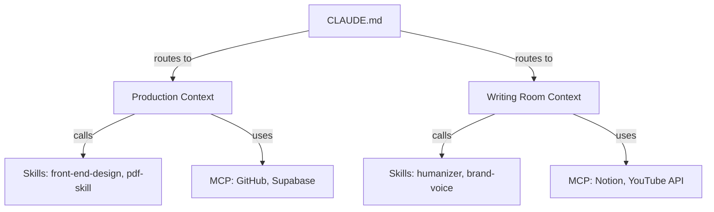
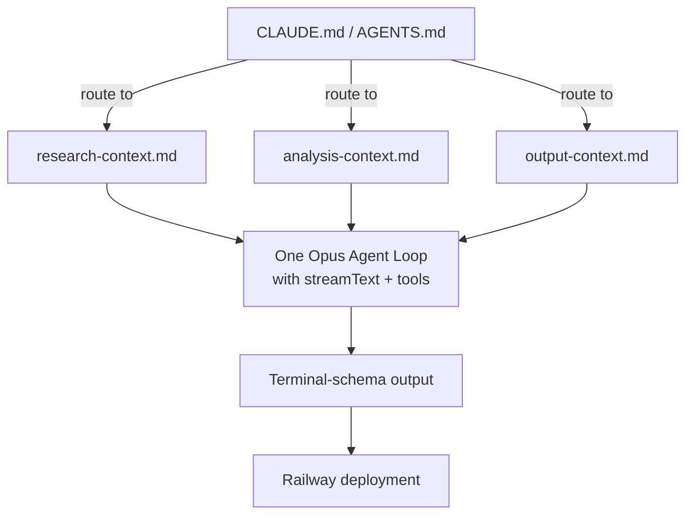

# Jake Van Clief — Agent Architecture & Folder-Based AI System Research

**Researched:** April 27, 2026
**Channel:** [@JEVanClief](https://www.youtube.com/@JEVanClief) — 29.5K subscribers, 153 videos
**Tagline:** *"In a world where everyone is teaching you left and right, I teach up and down."*
**Community:** Clief Notes (free on Skool) + Premium/VIP tiers ($27+/mo)

---

## Overview

Jake Van Clief teaches a **folder-based, single-agent architecture** for AI that replaces the common multi-agent/pipeline approach. His core thesis: **agents are a commodity — the folder is the app. Don't build separate agents for each task; route one Claude instance through well-structured workspaces using natural language.**

This research was conducted by watching his top 3 videos and one full community call (45 min), covering ~3 hours of content.

---

## Table of Contents

1. [The Core Thesis: Why Folders Beat Agents](#1-the-core-thesis-why-folders-beat-agents)
2. [The 3-Layer Routing System](#2-the-3-layer-routing-system)
3. [The 3-Workspace Blueprint](#3-the-3-workspace-blueprint)
4. [Naming Conventions Replace Databases](#4-naming-conventions-replace-databases)
5. [Why He Hates Multi-Agent Pipelines](#5-why-he-hates-multi-agent-pipelines)
6. [The Build-a-Workspace Process (From the Cowork Video)](#6-the-build-a-workspace-process-from-the-cowork-video)
7. [Skills vs MCP vs Context Files](#7-skills-vs-mcp-vs-context-files)
8. [Real-World Validation: Alexander's Story](#8-real-world-validation-alexanders-story)
9. [Business Philosophy Applied to AI](#9-business-philosophy-applied-to-ai)
10. [Direct AI-GOS Relevance Map](#10-direct-ai-gos-relevance-map)
11. [Key Quotes](#11-key-quotes)
12. [Recommended Watch Order](#12-recommended-watch-order)

---

## 1. The Core Thesis: Why Folders Beat Agents

### The Problem

Most people using AI are stuck in a loop:

- Chat → copy-paste → new chat → huge prompts → hit context limits → start over
- Burn tokens on irrelevant context because everything is in one prompt
- No persistence between sessions
- No ability to edit the AI's understanding of the workspace piece-by-piece

### The Solution

**Replace agents with folders.** A single Claude instance routes itself based on workspace context files. The architecture is:

1. A **folder** is an app / workspace
2. **Natural language routing files** (markdown) replace function calling
3. **Naming conventions** replace databases
4. **Skills** are loaded per-workspace, not globally

> *"The folder becomes your app. This is your UI. What's simpler than a folder? And the best part is I don't even need to technically click on anything — I could just talk with my voice to AI, have it do all the text work for me."*

---

## 2. The 3-Layer Routing System

This is the **core architectural pattern** — it appears in every video.

```
┌─────────────────────────────────────────────┐
│  LAYER 1: CLAUDE.md (The Map)               │
│  Loaded every time, always visible.          │
│  Contains: folder structure, naming          │
│  conventions, navigation rules.              │
│  "The floor plan on the wall."               │
├─────────────────────────────────────────────┤
│  LAYER 2: Workspace Context Files            │
│  Per-workspace markdown files loaded on      │
│  demand. Example: "Go to production" reads   │
│  production-context.md, not writing-room.md. │
│  "The actual rooms in the building."         │
├─────────────────────────────────────────────┤
│  LAYER 3: Skills + MCP + File System         │
│  Actual work happens here. Skills are loaded │
│  at workspace level, not globally. Files are │
│  organized by naming conventions.            │
│  "The tools and materials in each room."     │
└─────────────────────────────────────────────┘
```

### Why 3 layers?

> *"Most people are only doing one of these layers, maybe two. The reason you want all three is it stops the narrow funnel of AI doing too much all at once without allowing you to edit every single part but still gives you the ability to automate the entire process."*

In his research paper (5-layer version, unpublished), he adds layers for **abstraction depth** — the idea that higher-level decisions (what color watch?) should be separate from lower-level work (assembly). For most workflows, 3 layers is sufficient.

---

## 3. The 3-Workspace Blueprint

His template organizes work into three workspaces:

| Workspace | Purpose | Example |
|---|---|---|
| **Community** | Distribution, social, interaction | Post production, engagement, audience work |
| **Production** | Building, coding, designing | Animation pipeline, code builds, demos |
| **Writing Room** | Content, scripts, thinking | Blog posts, video scripts, strategy |

Each workspace has its own:
- **Context file** (describes what happens there, what tools to use)
- **Pipeline** (e.g. Production: Brief → Spec → Build → Output)
- **Skills** (only loaded when in that workspace)

### Example Pipeline (Production workspace)

```
Brief (context: technical standards)
  → Spec (context: design system + component library)
    → Build (context: code patterns + framework rules)
      → Output (context: deployment + naming conventions)
```

Each stage loads only the context it needs. The routing is defined by a simple table in markdown:

```markdown
| Task              | Files to Read                          | Skills Needed         |
|-------------------|----------------------------------------|-----------------------|
| Write brief       | tech-standards.md, style-guide.md      | —                     |
| Generate spec     | component-library.md, design-system.md | front-end-design      |
| Build             | code-patterns.md                       | web-app-testing       |
| Output            | naming-conventions.md                  | pdf-skill, deploy-skill|
```

> *"This table eliminates all of the problems. Without this, the AI either reads everything and runs out of tokens, or it guesses wrong about what matters."*

---

## 4. Naming Conventions Replace Databases

A key design decision: **you don't need a database or vector store for most use cases.**

```markdown
# Naming convention examples
blog-drafts/api-offer-guide-draft.md
newsletter/2026-03-launch-week.md
demos/ui-v2-demo-script.md
```

> *"I could just say 'pull my demo-v2 and build a spec from it.' It immediately knows where to look because it knows the naming convention. I have zero Python injection, no framework, no database."*

The `CLAUDE.md` file tells the AI the naming rules, so the AI can locate, organize, and move files without any external infrastructure.

---

## 5. Why He Hates Multi-Agent Pipelines

This is the most relevant section for AI-GOS. He dedicated significant time in the Cowork video to this:

### The Argument

> *"Anthropic ships features that make your custom agent framework obsolete every 3 months. The `/autorun` feature in Claude Code was literally someone's workflow — Claude captured it and turned it into a command."*

### Specific frameworks he calls out:

| Framework | His Take |
|---|---|
| **Crew AI** | "Basically a way to swap models without ruining your codebase. Everything you can do with a folder." |
| **LangChain / LangGraph** | "Ooh, these guys. They're doing DSPy — a framework for modular software that iterates on its own code. Interesting idea, not sure about feasibility." |
| **Semantic Kernel** | "Hooks, plugins, model swapping — same thing you can do with a folder in 5 clicks." |
| **Claude Bot / Custom Agents** | "It's just an orchestration layer. Orchestration layers get added to every AI. The companies with the AI do it better, faster, cheaper." |
| **DSPy** | "I like their ideas — optimizing prompts and weights. But I'm curious about wide adoption." |

### The core logic

> *"Why build a $10M agent framework when you're trying to create value in your business? If you're building a refrigeration company, you don't build a new compressor — you buy the best one on the market and design your product around it. Same with AI. Anthropic has 5,000+ engineers making Claude better every week. I'm one guy. I'm not going to out-build them. I'm going to out-think them."*

### On commoditization

> *"The more the less effort it takes from you to get a good output over time, the closer you are to this becoming a commodity. That's how you find the next thing to sell. People used to sell prompts — I give them away for free now. In 6 months, my workflows will be features. The thing that can never be automated is time spent with me."*

---

## 6. The Build-a-Workspace Process (From the Cowork Video)

This 51-minute video shows his exact process for creating a new AI workspace from scratch. He built a writing/scripting workspace for his own YouTube channel.

### Step-by-step:

1. **Create a folder** (empty, on desktop)
2. **Open with Claude Code** or Claude Cowork (both work)
3. **First prompt**: Describe the workspace conceptually, not tasks. *"This is a writing and scripting area for my YouTube channel about AI architecture."*
4. **Feed source material**: Paste transcripts of your best-performing content, not generic instructions
5. **Let Claude explore**: It will create files, a CLAUDE.md, and folder structure
6. **Read Claude's thinking**: *"Every single one of these words is a coordinate in its vector space. If it's off a little bit, that little bit grows the more you use it."*
7. **Iterate on voice**: Don't let Claude describe your voice; let Claude create a markdown file that future versions of itself can refer to. *"Telling it how to write creates more patterns that end up sounding AI anyway."*
8. **Break markdown files apart**: When a context file gets >100 lines, split it. *"Your whole goal is to break apart thinking itself — separation of concerns for your AI's brain."*
9. **Feed real data**: He scraped 150+ YouTube comments and fed them to Claude. Claude extracted content pillars, audience needs, and structural insights — without being told what to produce.
10. **Test on a fresh instance**: Open a new Claude window in the workspace. If the routing works with minimal prompting, the system is sound.

### Key insight about process:

> *"The goal isn't for the AI to tell you how to do things. The goal is for it to organize how you're already doing it and make it better."*

---

## 7. Skills vs MCP vs Context Files

### Skills

- Markdown files or Python scripts that encode a **process**
- Can be downloaded from GitHub, Claude Design, or the community
- Work best when wired into a routing system, not loaded globally
- *"Skills are processes that someone else figured out. But skills aren't just markdown files with instructions — they work best when wired into a system."*

### MCP (Model Context Protocol)

- A way for AI to talk to external apps and services
- Plug-and-play: AI can discover and use MCP tools without custom integration
- *"Think of it as a way the AI can talk to other apps and services easier. It's designed to just plug and play rather than creating custom integrations."*

### Context Files

- Markdown files that describe **what a workspace is and how to work in it**
- These are the 2nd layer — the "rooms" the CLAUDE.md routes to
- Should be short (<100 lines) and focused on one domain

### How they work together



---

## 8. Real-World Validation: Alexander's Story

From the community call (video we watched first). Alexander is a community member who applied Jake's system at a **commercial real estate company** in Grand Rapids, Michigan (20 buildings, ~$10M portfolio).

### What he did

- Worked at the company with no AI mandate — just started applying what he learned
- Identified a tedious department handoff process (Crystal's job) that consumed 6th of her time annually
- Built a **folder-based system** with markdown workflows and **humans-in-the-loop at each layer**
- Saved the company ~$10K/year
- Crystal went from overwhelmed to loving her job again
- Now he's the internal AI lead, planning to roll it out across departments

### Key design decision

> *"We basically created a copy-paste template file — then the next layer is: 'Do we really want to automate it?' Maybe if we can do it 100 times in a row, maybe it's automation. But right now it's easy enough that you can go through and review."*

This echoes Jake's central message: **augment, don't fully automate.** Keep humans in the loop where judgment matters.

### The vision

> *"If we can get this going, I can change the whole city even. We're a platform more than anything. So why don't we have the best platform in town?"*

---

## 9. Business Philosophy Applied to AI

### On commoditization

> *"The more the less effort it takes from you to get a good output over time, the closer you are to, 'Hey, this is a commodity.' You need to find out what the next layer is above that."*

### On selling vs giving away

> *"If you believe your value is truly valuable, you should be able to give it away for free and charge at the same time. Someone could go through all my videos and all my VIPs — I still have more value to offer because I sit down with their company and there are 10 million other problems that show up."*

### On building around AI companies

> *"Don't try to compete with Anthropic. I'm not trying to build the next Claude. I'm trying to get business deliverables. They have 5,000+ engineers making their product better every week. I can't out-build them. But I can out-think them and build systems that assume the AI layer keeps getting better."*

### On the future of universities

> *"The future of school is that each of you should be walking away with software or APIs or your own agents that you can sell. You built it during your process. The school doesn't have to charge tuition — everyone just shares the wealth based on value output."*

### On software being a commodity

> *"I'm so positive that software is a commodity now. The things that are moats are the next abstraction layers, and I don't think we've fully figured out what those are. Communities that build software, share equity, produce value — that's the real product."*

---

## 10. Direct AI-GOS Relevance Map

| AI-GOS Problem (from architecture audit) | Jake's Solution | Match |
|---|---|---|
| **7-runner pipeline**: 30% context loss per stage as data passes through 7 sequential runners | **Single-agent routing**: one Claude instance reads per-workspace context on demand. No pipeline stages = no context decay | ✅ Direct |
| **Prompt bloat**: `competitors.ts` prompt is 10K+ bytes with 18+ negative guardrails | **Break into small context files**: max 100 lines per file, loaded on demand. Routing table tells AI exactly what to read | ✅ Direct |
| **Wiki writes but no runner reads**: wiki layer produces data no downstream runner consumes | **CLAUDE.md as persistent context**: workspace map is read every time. No orphan outputs | ✅ Direct |
| **Unvalidated partials**: `research-sandbox.ts:776` treats partial/error output as complete | **Human-in-the-loop at each layer**: "Do we really want to automate it? Maybe if we can do it 100 times in a row." | ✅ Direct |
| **Dead evals**: 9 eval files, zero wired to CI | **Skills as testable processes**: skills encode repeatable workflows that can be verified | ✅ Partial |
| **Model downgrade**: Opus declared but runners use Haiku | **One Opus agent with routing** — the model is consistent, the context changes | ✅ Direct |
| **Blind wiki + competitors**: tools that write data nobody reads | **Context files are self-referential** — the system is designed so everything gets read or it gets removed | ✅ Direct |
| **Stack choice (Railway + Supabase + Next.js)**: already correct, wrong code inside | Jake uses Railway for his own infra (mentioned in community call). Aligns with his "don't overcomplicate" philosophy | ✅ Aligned |

### What AI-GOS would look like if it followed Jake's pattern

Instead of a 7-runner pipeline:



The key difference: **one agent, three workspaces, loaded on demand.** No data passes between runners; the agent reads the right context file for the current task.

---

## 11. Key Quotes

> *"Skills are processes of thought turned into a package. All of Claude's features are processes of thought turned into a command. The more you can package processes and pull the fundamentals, the more you can focus on what's unique."*

> *"Your competition becomes your development team. They ship features that solve your workflow problems."*

> *"In a world full of answers, questions become valuable."*

> *"The only prompts that are going to be useful in a year are the ones that ask you questions, not ones that answer it for you."*

> *"Every word you give Claude is a coordinate in a massive multi-dimensional vector space. You're giving it a map to find data."*

> *"Don't start with tasks. Start by conceptualizing the working space for it before you start working in that space."*

> *"The folder becomes your app. What's simpler than a folder?"*

> *"Stop selling agents. Sell a company that uses agents better than anyone else."*

> *"If you believe your value is truly valuable, you should be able to give it away for free and charge at the same time."*

> *"I want to teach the concepts that last, not the concepts that are replaced next month."*

---

## 12. Recommended Watch Order

| # | Video | Duration | Views | Why Watch |
|---|---|---|---|---|
| **1** | *Stop Building AI Agents. Use This Folder System Instead.* | 23 min | 70K | His flagship. Covers the full 3-layer system, workspace blueprint, naming conventions, routing table. Start here. |
| **2** | *Why I Stopped Building AI Agents and Started Using Claude Cowork* | 51 min | 18K | Live build of a workspace from scratch. Shows the process — creating CLAUDE.md, feeding transcripts, iterating on voice, building pillars from comments. Most practical. |
| **3** | *Claude Design Full Breakdown: GitHub Imports, Skills, and Local Model Handoff* | 42 min | 5.9K | Infrastructure depth — importing skills, local vs cloud handoff, MCP integration. |
| **4** | *The Real Skill in AI: Knowing What Not to Automate* | 45 min | 3.8K | Community call. Alexander's real estate story, business philosophy, commoditization framework. |

---

## Methodology

This research was conducted by:

1. Fetching the full transcript of the community call video (45 min) — the one originally shared
2. Identifying the channel and creator (Jake Van Clief, @JEVanClief)
3. Browsing his channel video listing to identify the top 3 most relevant videos to AI agent architecture
4. Fetching full transcripts for all 3 videos using the YouTube Transcript API
5. Analyzing and synthesizing key concepts, patterns, and direct AI-GOS mappings
6. Creating this document for reference during the AI-GOS refactor

Total content analyzed: ~3 hours of video, ~130K characters of transcript text.
